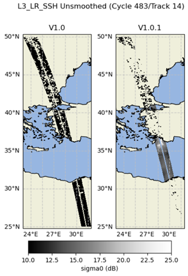

V1.0.1 changes
==============

Unsmoothed
----------

An anomaly was detected in the Unsmoothed V1.0 netcdfs. The geophysical
corrections (ocean_tide, DAC), the MSS, MDT and sigma0 values in the product had
an inverted sea/land mask.

Below is an illustration of the anomaly and its correction:

