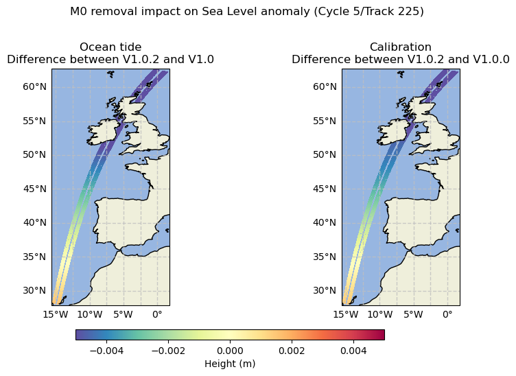
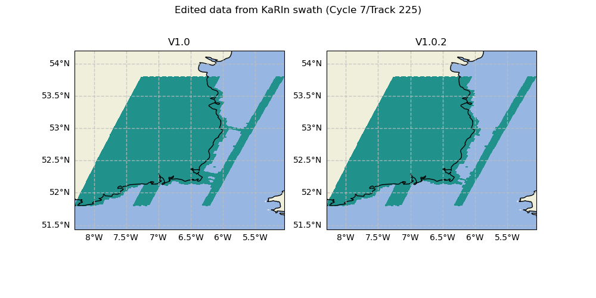
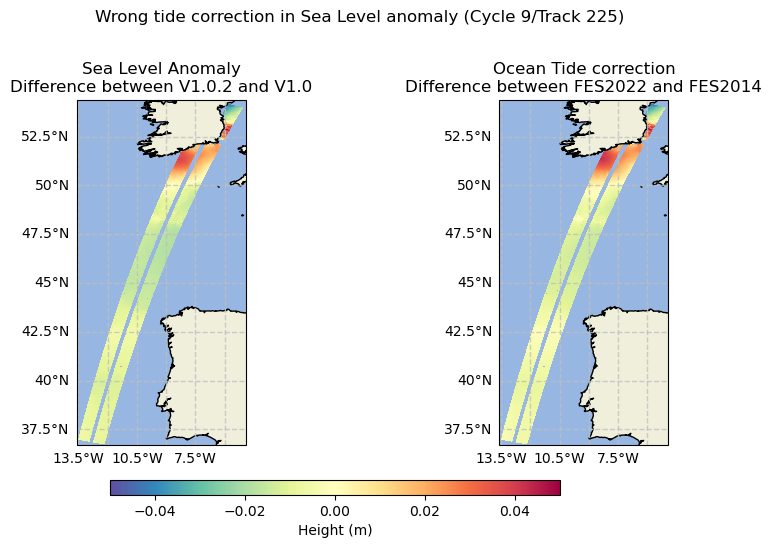
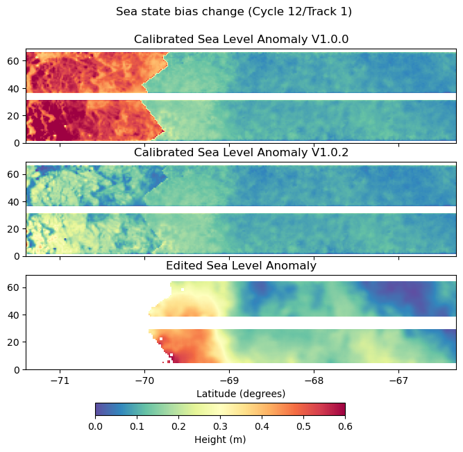

V1.0.2 changes
==============

Basic, Expert and Unsmoothed
----------------------------

M0 wave removal
+++++++++++++++

The M0 wave has been removed from the ocean tide correction FES2022
configuration. This change has a very small impact for users using the
calibrated Sea Level Anomaly, because this large scale signal is absorbed by the
calibration error in the V1.0.0.

The following figure illustrates the impact of removing the M0 wave over the
ocean tide correction (left) and over the calibration (right). The patterns are
similar, confirming the small impact over the calibrated Sea Level Anomaly.

Basic and Expert
----------------

Editing near the coast
++++++++++++++++++++++

The V1.0 introduced a newer and finer land-sea mask. The editing parametrization
for pixels near the coast was not properly adjusted, which can cause wrongly-edited
lines in the quality flag near the coast. The new parametrization fixes this
issue in the V1.0.2

Ocean tide in Sea Level Anomaly
+++++++++++++++++++++++++++++++

For products based on PIC upstream data, the ocean tide correction has been
wrongly applied. The ``ocean_tide`` field contains the expected FES2022 model, but
the sea level anomaly has been corrected using an alternative FES2014 field. The
V1.0.2 fixes the tide correction in the sea level anomaly.

.. note::

    This issue only impacts Basic and Expert datasets starting from cycle 7

Sea state bias filling
++++++++++++++++++++++

Regions with ice have a default value for the Sea State Bias (SSB) correction.
This default value introduced a bias on the non edited Sea Level Anomaly between
the high latitudes and the rest of the ocean. This is of no consequence over the
edited ``ssha`` or filtered Sea Level Anomaly ``ssha_noiseless`` because these
regions are edited. However, this can be seen on the calibrated Sea Level
Anomaly ``ssha_unedited``. The SSB filling method has changed to mitigate this
effect.

.. note::

  This change only affects the sea state bias correction in the Basic and Expert
  products. The Unsmoothed product is still affected by this issue.

.. _v1-blending:

PIC/PGC blending
++++++++++++++++

Because the PGC does not cover the most recent periods, the L3_LR_SSH upstream
data is a blending of two L2_LR_SSH versions: PIC and PGC. Previously, the PGC
to PIC switch was at Cycle 7 but newly available data made it possible to use
PGC data up to Cycle 9.

To summarize the upstream data versions:
    * PIC0 starting from Cycle 9 / Track 388
    * PGC0 up to Cycle 9 / Track 387 included, minus the exceptions listed in
      the following table

.. list-table:: List of PIC half orbits (ranges are inclusive)

    * - Cycle 7
      - [521-531], 533, [535-536], [538-542], [544-547]
    * - Cycle 9
      - [335-336], [388, 584]

Unsmoothed
----------

Temporal coverage
+++++++++++++++++

The current dataset V1.0.2 includes all data for Calval phase and data up to
cycle 16 for Science phase.

Missing half orbits with respect to Expert dataset
++++++++++++++++++++++++++++++++++++++++++++++++++

The calibration field is interpolated from the Expert product. This
interpolation needs a consistent uncalibrated sea level anomaly between the two
products. A version discrepancy between the Expert and Unsmoothed product means
that the sea level anomalies are not consistent.

Due to production constraints, some half orbits have different upstream versions
for the Expert and Unsmoothed products. These half orbits have been removed, and
will be retrieved in a future reprocessing.

.. list-table:: List of missing half orbits due to upstream version discrepancy (range are inclusive)

  * - Cycle 1
    - 561
  * - Cycle 3
    - 322
  * - Cycle 4
    - 158, 160
  * - Cycle 6
    - 297, 298
  * - Cycle 7
    - [532-534], 537, 543​
  * - Cycle 8
    - [244-245]​
  * - Cycle 9
    - [304-331], [337-387]
  * - Cycle 11
    - [381-382], 384
  * - Cycle 13
    - [261-262], [544-570]​
  * - Cycle 15
    - 70, 72, 74, 135, 137
