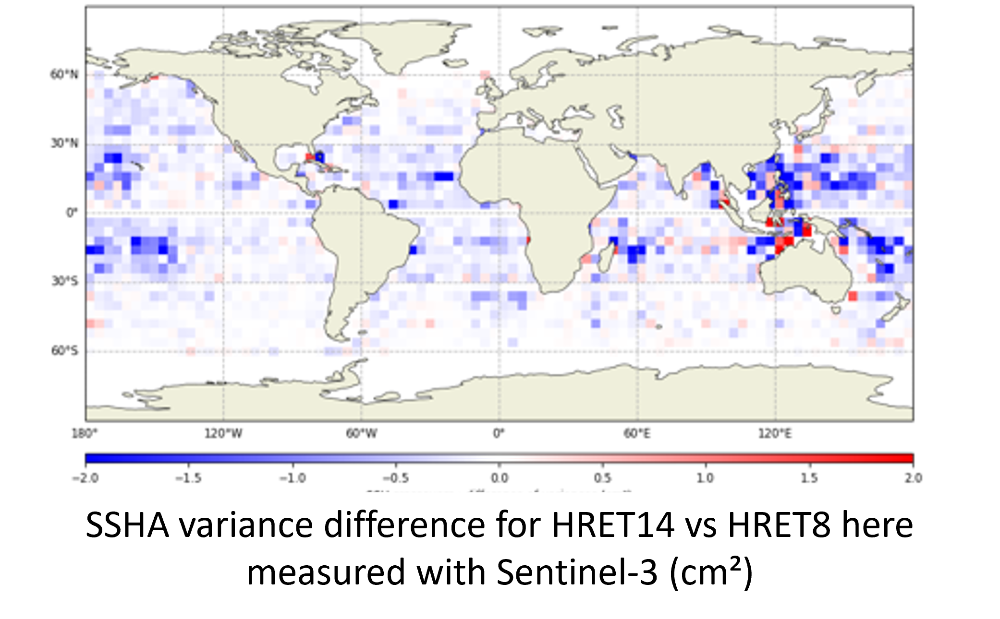
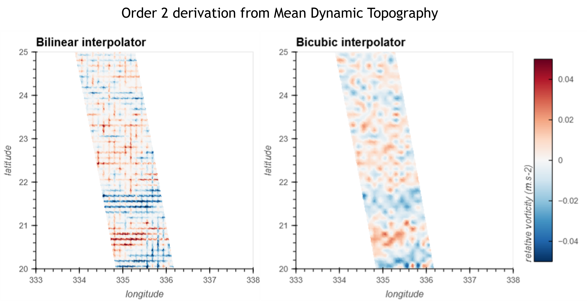
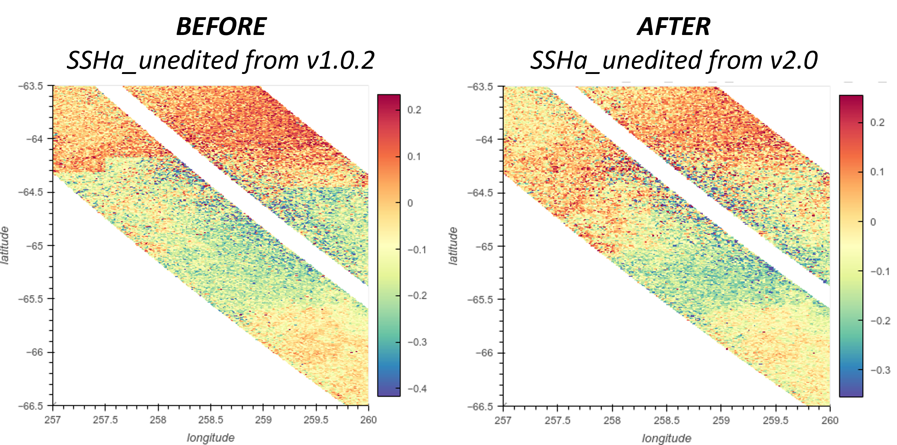
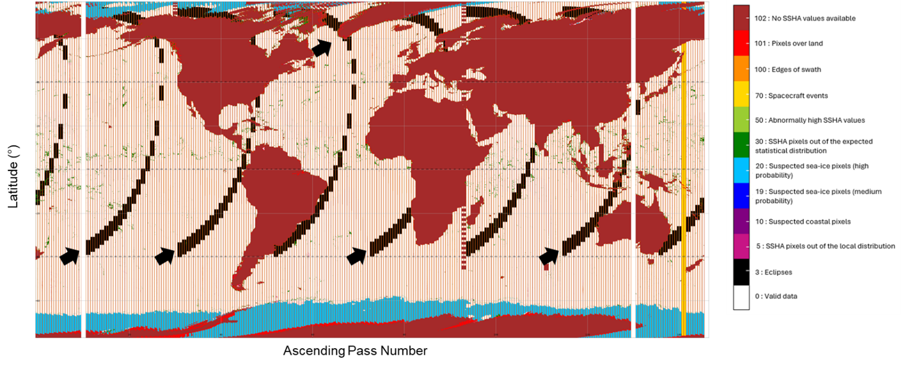
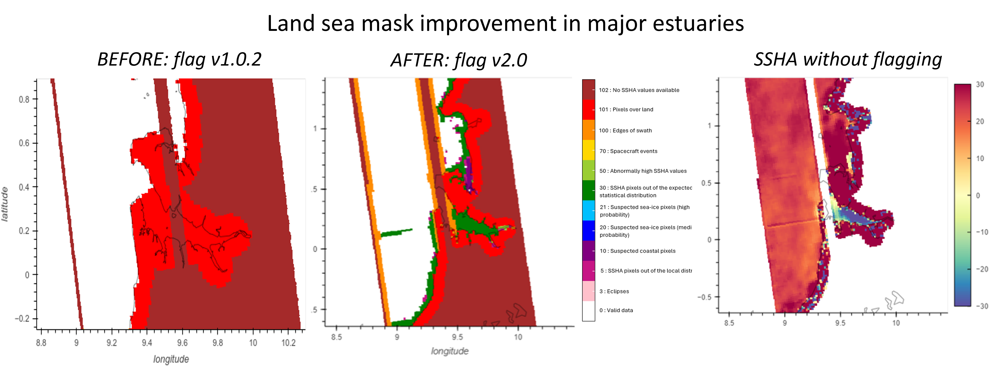
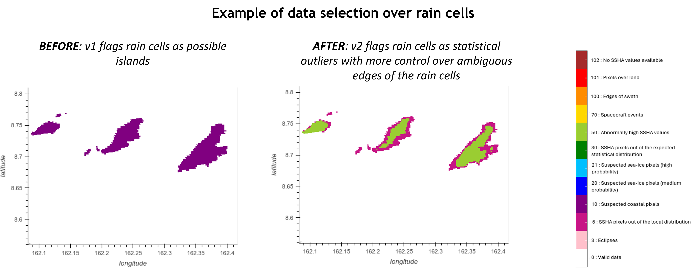
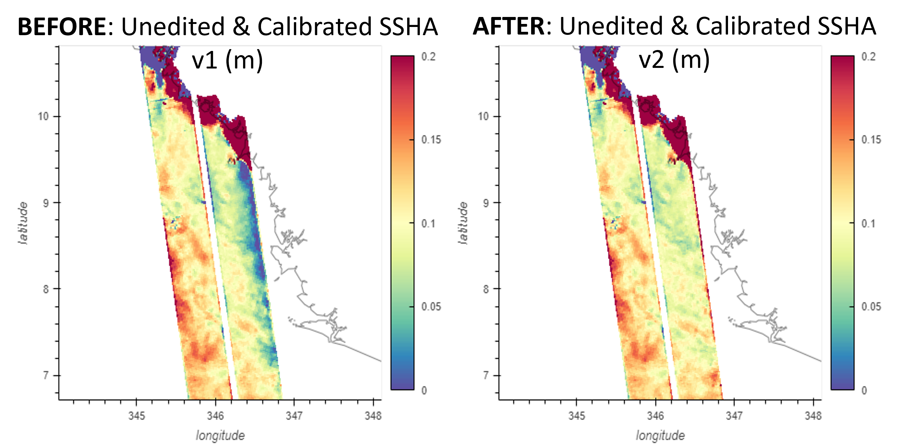

V2.0.0 changes
==============

.. note::

  There is no Unsmoothed dataset for V2.0.0. The Unsmoothed dataset has been
  released under V2.0.1 following the resolution of minor issues. Please check
  the :ref:`V2.0.1 release note`

Basic, Expert and Unsmoothed
----------------------------

PIC/PGC blending
++++++++++++++++

The PIC/PGC blending does not differ from the version 1 (see
:ref:`v1-blending`).

Geophysical corrections
+++++++++++++++++++++++

Internal tide model blend (HRET14/HRET8.1)
..........................................

The internal tide correction is improved in v2.0 with the use of a blend
solution of HRET14 & HRET8.1 model (Zaron, 2024). HRET14 resolves the coherent
tides for 5 different tidal frequencies (M2, K1, S2, O1, N2) while HRET8.1 uses
4 tidal frequencies (M2, K1, S2, O1).The blend HRET solution is slightly more
accurate than HRET 8.1 over most of the open ocean (3 mm RMS, locally 1 cm;
Consistent numbers found with SWOT Nadir, SWOT Karin, Jason-3, Sentinel-3 and
6 missions). The gain is however not geographically homogeneous. Like HRET8.1,
the blend solution is based on nadir altimetry and it does not correct for
higher modes of IT, non linear waves, solitons, and non-stationary tides. The
blend HRET solution is delivered in a dedicated variable of the L3 v2.0
products, allowing the user to uncorrect and replace it.

MDT bias
........

A negative 5cm offset was introduced in the MDT field model, and resulting ADT.
This offset fixes known discrepancy between SWOT and other L3 products from
CMEMS & DUACS. It was introduced in the CMEMS & DUACS production in 2014,
following a change of the arbitrary altimeter reference period used
([1993, 1997] vs. [1993, 2012]).

MDT bicubic interpolator
........................

The Mean Dynamic Topography is computed from a static auxiliary data file. The
interpolation method for regridding the auxiliary onto the swath grid in v1 was
a bilinear interpolation. Computing the second order derivative from the
interpolated MDT shows cross-shaped artifacts. To reduce these patterns, the v2
now interpolates the MDT using a bicubic interpolation method.

Sea state bias offset in polar transitions
..........................................

The SSB2 correction of the L2 PIC/PGC product is used in L3 production. This
solution is based on MFWAM model output that shows limitation of definition in
polar and coastal areas. Consequently, a know offset of 10cm is introduced in
SSB2 in these areas, impacting the resulting SSHA with introduction of net
discontinuities. In L3 V2, the SSB2 correction is extrapolated towards 0 in
polar areas in order to remove the SSH discontinuities that may limit polar
studies (e.g. Figure 12). This was done assuming the in sea-ice leads SSB is
close to zero (small waves), so we enforce continuous transition from open ocean
to sea-ice leads. Nevertheless, this extrapolation does not yield a
correct/geophysical SSB correction. This quick fix intends to remove only the
SSB2 offset in a gradual way, but the SSHA remains biased (no wave height
available in these regions = SSHA bias).

Flagging changes
++++++++++++++++

.. _eclipse-transition:

Eclipse transition
..................

Eclipse transition segments are isolated from other SWOT mission events
(e.g. maneuvers) & flagged with a specific value. The performance analyses from
the L2 Project CalVal and L3 teams did not observe any degradation for these
segments. Consequently, the SSHA is now provided during eclipse transitions,
improving the coverage by 4%. The users of expert and unsmoothed products can
choose to remove these segments by using the specific flag value.

.. _osm-mask-improvement:

Land-sea mask / Surface type
............................

In V1.0, we :ref:`introduced a mask<osm-mask>` that fixes most of the known L2
issues but shows some failures in the estuaries (refer to the
:ref:`change note<osm-mask-limitation>`). In V2.0 we now use a revised mask with
manual processing of 43 major estuaries to retrieve them. The quality flag is
updated consequently. Nevertheless, estuaries with no SSHA in the L2 cannot be
retrieved in the L3 (known PIC/PGC issue, not related to land mask), and
retrieved SSHA can be rejected with other statistical criteria.

Other changes
.............

The selection flag algorithm was revisited to reduce the occurrence of ambiguous
rejection criteria (e.g. rain vs coast), and to take into account areas better
retrieved with revised L3 SSB2 (see previous section). In that last case, only
pixels with an ice concentration higher than 60% and those on the edge of the
polar ocean are flagged as “suspected sea-ice pixels” (flag 20)

.. image:: changes_2.0.0_polar_editing.png
  :align: center
  :width: 800

The data selection sequence is also better integrated with the L3 calibration,
improving the quality of the latest.

Product content
+++++++++++++++

Renamed variables
  * ``ssha`` -> ``ssha_unfiltered``
  * ``ssha_noiseless`` -> ``ssha_filtered``
  * ``ugosa`` -> ``ugosa_filtered``
  * ``vgosa`` -> ``vgosa_filtered``

New variables
  * ``internal_tide`` contains the internal tide solution applied to all SSHA
    fields
  * ``ugosa_unfiltered`` and ``vgosa_unfiltered`` contains the zonal and
    meridional geostrophic velocities anomalies derived from ``ssha_unfiltered``.
    The field is very noisy so the user should apply a smoothing.

Basic and Expert
----------------

Calibration
+++++++++++

The calibration in v1 was absorbing other geophysical error residuals (see the
SWOTST 2024 Talk) and not just KaRIn systematic errors. The calibration
algorithm and sequence was thus improved in v2 with the objective to reduce the
leakage of ocean dynamical signal and to take into account improvements done on
the data selection processing:

  * A large part of the data selection is now applied before calibration
  * Data eclipse transition segments are used in the calibration
  * A more sophisticated handling of the bias/linear/quadratic terms and the
    orbital harmonics VS broadband interpolators is introduced: fewer degrees
    of freedom are used in order to calibrate only what is absolutely needed and
    ignore uncalibrated error sources when calibration is not possible or
    desirable.

This results in better correction for the semi-enclosed / coastal / polar seas
and Hydrology. On counterpart, more tidal, SSB and Wet troposphere residual
signals may be observed in SSHA field.

