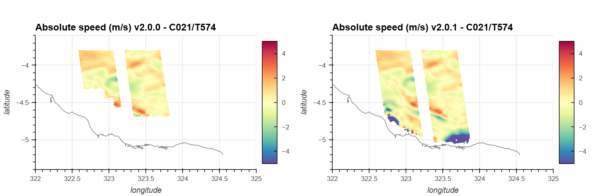
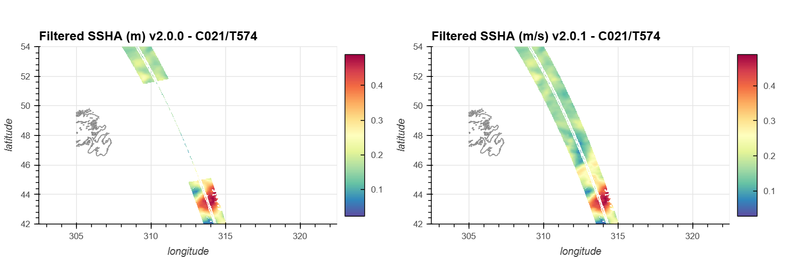
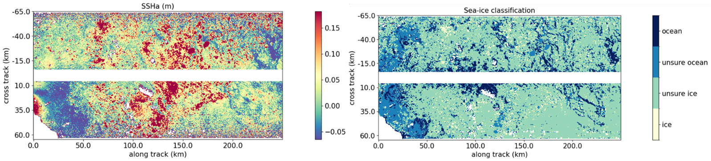
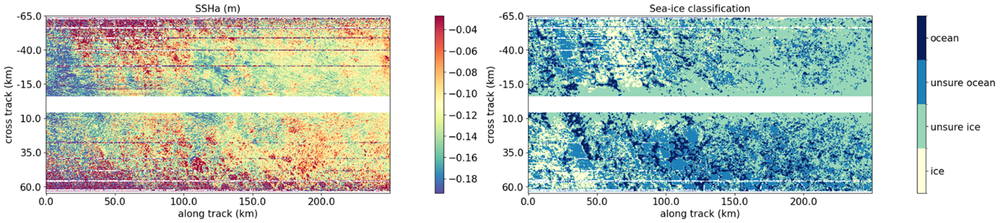
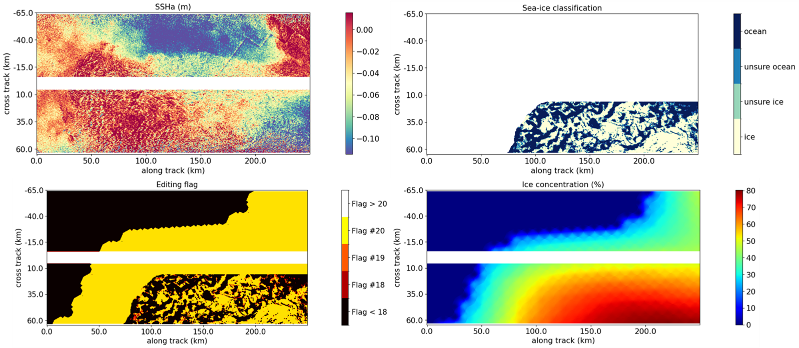
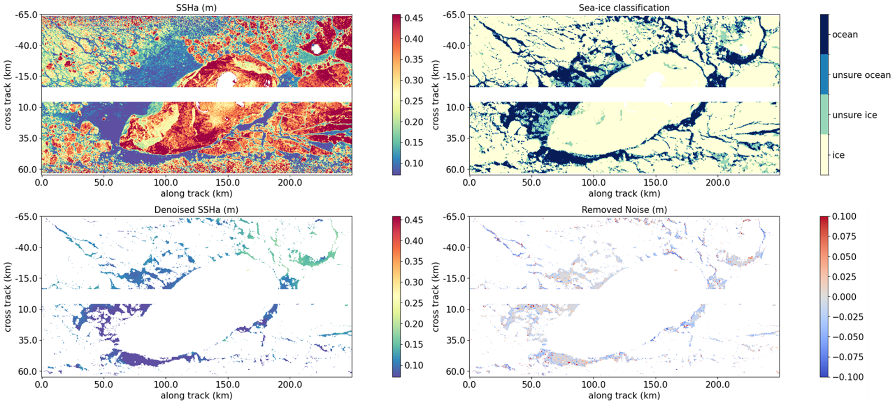

.. _V2.0.1 release note:

V2.0.1 changes
==============

Basic, Expert
-------------

MDT and absolute derivatives near the coasts
++++++++++++++++++++++++++++++++++++++++++++

Due to a change in the MDT/MDU/MDV interpolator in the V2.0.0 (switched to
bicubic), some points near the coast have been lost with respect to the V1.0.2.

In order to mitigate this issue, the source grids for MDT/MDU/MDV are filled
using a `Gaussian-Seidel <https://cnes.github.io/pangeo-pyinterp/generated/pyinterp.fill.gauss_seidel.html#pyinterp.fill.gauss_seidel>`_
method. This prevents the loss of points in the ``mdt``, ``ugos`` and ``vgos``
fields.

Wrong flag application in eclipses
++++++++++++++++++++++++++++++++++

The editing flag was wrongly applied on the sea surface height in the netcdf
products. Although the eclipses where present in the ``ssha_unedited`` field,
they were wrongly removed in the ``ssha_unfiltered`` and ``ssha_filtered``
field. This has been fixed and the eclipse data is properly available as
annonced in the :ref:`V2.0 change note<eclipse-transition>`

Unsmoothed
----------

Flagging changes
++++++++++++++++

Land-sea mask
.............

In V1.0, we :ref:`introduced a mask<osm-mask>` that fixes most of the known L2
issues. This mask was used in the Basic and Expert datasets but not in the
Unsmoothed dataset. V2.0.1 now aligns the land/sea masks of all 3 datasets by
using this mask in the Unsmoothed product. Note that the
:ref:`patch improvement<osm-mask-improvement>` introduced in V2.0 is also
applied

Sea-ice leads flagging
......................

LEGOS has developed a sea-ice classification for polar areas. It provides
several information:

  * ocean (flag #0)
  *	ocean_unsure (flag #18)
  *	ice_unsure (flag #19)
  *	ice (flag #20)

Summer in the Arctic (May-September) is still exploratory because of the
presence of melt-pounds on the sea ice. As this product is experimental, a few
imperfections have been identified.

Some passes contain mostly ``unsure`` categories

  Cycle 484 Pass 9

Along-track lines due to radiation hits (more details
`here <https://archive.podaac.earthdata.nasa.gov/podaac-ops-cumulus-docs/web-misc/swot_mission_docs/D-109532_SWOT_UserHandbook_20240502.pdf>`_
) may be visible and deteriorate the classification

  Cycle 577 Pass 24

Ice classification is only applied when the ice concentration exceeds 50%.
Between 0 and 50% of ice concentration, the data is automatically edited with
flag #20

  Cycle 500 Pass 1

Finally, denoising is available for leads. It only seems relevant when the
sea-ice classification is correct

  Cycle 507 Pass 1

Product content
+++++++++++++++

New variables
  * ``cross_track_distance`` was missing in the Unsmoothed files. It is now
    available in the netcdf products.

Basic, Expert and Unsmoothed
----------------------------

Manual editing of problematic half orbits
+++++++++++++++++++++++++++++++++++++++++

Some half orbits of the calval phase are not well calibrated and were not
properly detected by the editing algorithm. The quality flag of these half
orbits has been set to 30 to mark them as bad:

.. list-table:: Newly edited half orbits (ranges are inclusive)

    * - Cycle 567
      - [20-28]
    * - Cycle 568
      - [1-7], [10-13]

Product content
+++++++++++++++

For clarity purpose, some variables have been renamed in the product. Note that
this renaming only affects V2.0.1: the old names are still in use for V2.0

Renamed variables
  * ``ugos`` -> ``ugos_filtered``
  * ``vgos`` -> ``vgos_filtered``
