V3.0.0 changes
==============

.. note::

    This release exclusively covers the 2x2 km resolution products, comprising
    the Basic, Expert, and the newly introduced Technical dataset

Basic and Expert
----------------

New MSS CNES_CLS_2025
:::::::::::::::::::::

The Mean Sea Surface (MSS) used for Sea Surface Height Anomaly (SSHA)
construction has been updated in version 3. The MSS Hybrid 2023 (Laloue et al.
2024), previously used in version 2, has now been replaced by a beta version of
the MSS CNES_CLS_2025, as presented by (Charayron et al. 2025). This MSS
integrates 30 years of nadir altimetry data with 25 cycles of SWOT-KaRIn 2km
measurements from the science orbit phase. A specific correction, identified as
"MSS compression correction" is taken into account during the processing. It
allows to mitigate the inconsistency between the SSH resolved scale by KaRin 2km
and nadir 1Hz products and the resolved scales of the MSS directly interpolated
on the measurement position. It allows to retrieve the full MSS signal from
compressed altimeter measurements.

The use of DUACS DT-2024 multi-mission gridded products contributes to managing
ocean variability and maintaining the 20-year reference period [1993-2012] for
this new MSS. Additionally, the implementation of the MIOST mapping algorithm —
which accounts for a dynamic internal tide mode (Ubelmann et al. 2022) —
enhances the separation of KaRIn measurements between small-scale ocean
variability and small-scale static MSS signals.

This results in a more accurate definition of MSS structures at scales below 100
km. Validation with independent measurements highlights a global mean SSHA
variance reduction of 10% over wavelengths ranging from 10 to 125 km, with
improvements reaching up to 20% around the 20-30 km scale. These gains are
primarily concentrated along geodetic structures, where local reductions in
variance exceed 1 cm².

The adoption of this new MSS significantly reduces the imprint of geodetic
structures in the resulting SSH data.

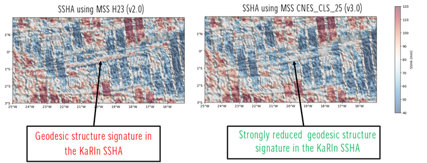

    KaRIn SSHA from cycle #16 in the equatorial Atlantic area, over a transform
    fault. SSHA is superimposed with bathymetric gradients. SSHA in V2.0 (left)
    and V3.0 (right) product version. (no data selection applied)

.. note::

    The MSS CNES_CLS_2025 is not optimized for coastal areas or polar regions.

Ocean tide estimation extended in estuaries areas
:::::::::::::::::::::::::::::::::::::::::::::::::

.. _blend-fes:

The ocean tide correction from the FES_2022 unstructured mesh, used in the
version 2 product, is not defined across the full extent ofcertain estuarine
areas. As a result, in most cases, the ocean tide correction and resulting
corrected SSHA are missing in the extremities of estuaries. To address this
limitation, the v3 product complements the ocean tide correction in these
regions with the FES_2022 extrapolated structured grid solution. This
enhancement enables retrieval of the SSHA solution across the entire estuarine
domain sampled with KaRIn.

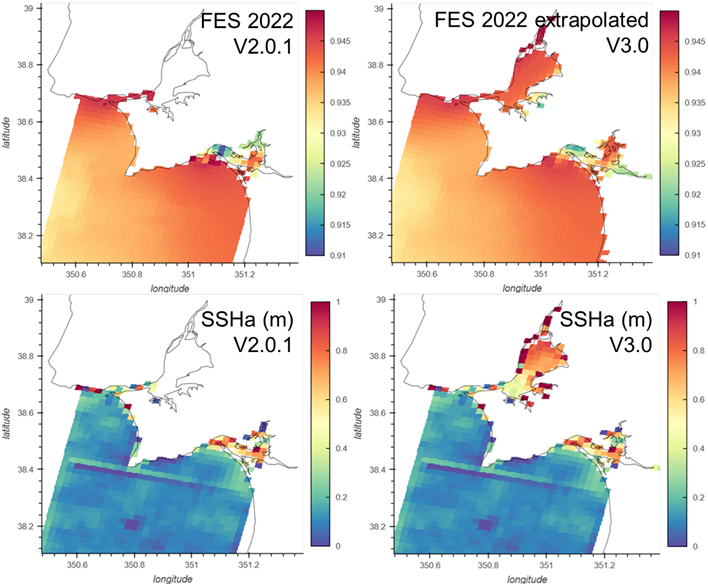

    Example of the impact of the extrapolation of FES 2022. Case of an estuary
    in Spain - Only land sea mask data selection applied

.. note::

    The blended ocean tide solution does not guarantee full continuity across
    the transition zones between the two combined solutions, and some
    discontinuities may be observed. Additionally, the accuracy of the ocean
    tide solution remains limited in such area

Data selection improved
:::::::::::::::::::::::

.. _osm-auto-mask-improvement:

Data selection was improved by introducing a new land-sea mask selection
criterion. The retrieval of estuarine areas using a high-resolution land-sea
mask, first initiated in version 2, has been generalized in version 3.0. To
achieve this, OpenStreetMap (OSM) polygons defining coastal and estuarine
regions were used to construct the land-sea mask implemented in version 3.
This enhancement enables systematic retrieval of most estuaries.

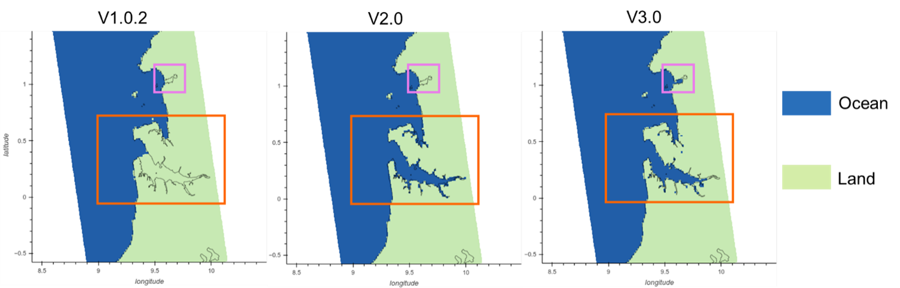

    Example of land-sea masks used in V1 (left), V2 (center), and V3 (right).
    Orange boxes highlight an estuary that was not resolved in the V1 version,
    manually retrieved in V2, and automatically resolved in V3 using OSP estuary
    contours. Pink boxes show an example of an estuary not resolved in either V1
    or V2, but retrieved in V3 thanks to OSP estuary contours.

.. note::

    OSM polygons remain imperfect, and narrow estuaries or their extremities may
    not be fully resolved—particularly when using the 2 km resolution mask.
    Additionally, some rivers and small inland surface water bodies near the
    coast may be misclassified as sea in this new version of the mask. A valid
    data selection flag is used to reject measurements over such areas

Additionally, the data selection quality flag was improved near the coast to
better detect remaining in-land pixels. In v2.0.1, some unedited pixels could
remain very close to the coastline. In v3.0, these pixels are edited by flag 10.

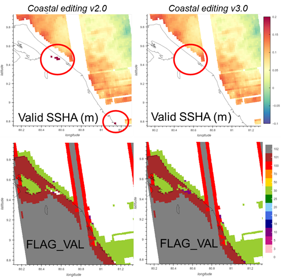

    Example of coastal editing in V2 (left) and V3 (right). SSHA selected with
    flag_val value > 5 (top) and flag_val (bottom). Red circles show an example
    of invalid and inland SSHA pixels that were not rejected in V2 and now
    accurately rejected in V3 with dedicated "#10: suspected coastal pixels"
    flag_val value

The granularity of the flag_val parameter was enhanced to better identify
measurements affected by rain cells. To achieve this, independent precipitation
rate estimates proposed by (Picard et al. 2025) were used to introduce a new
flag_val value #25, which marks measurements that were initially rejected based
on the version 2 data selection criteria—primarily due to anomalies in the SSHA
statistical distribution. The precipitation rate information is provided in the
new Technical product.

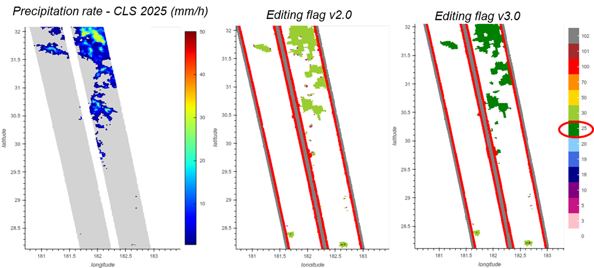

    Example of refined flag_val granularity with #25 “rain event” value.
    Independent precipitaton rate (left), invalidated measurement in V2 using
    different data selection criteria (center), editing flag refined in V3 using
    precipitation rate (right)

.. note::

    The data selection criteria implemented in version 3 do not directly rely on
    precipitation rate. At this stage, precipitation rates are used solely to
    refine the potential origin of SSHA anomalies within the flag_val framework.
    A more integrated use of precipitation data should be considered for version
    4 to enable consolidated data selection. Furthermore, the precipitation
    rates used in version 3 are not fully optimal. The two versions available
    have distinct strengths and weaknesses. Improved versions should be explored
    in future Level 3 KaRIn data production

Calibration improvement
:::::::::::::::::::::::

Calibration processing in the version 3 product was improved as follows:

- First, predictable calibration components are now more accurately identified
  and estimated using functions whose parameters are fitted to observational
  data. In future version 4 releases, this approach will be further refined to
  better account for the dependence of linear parameter on the beta angle.
- Second, the methodology for interpolating unpredictable calibration components
  in areas where direct estimation is not feasible has been enhanced. Version 3
  now applies optimal interpolation to estimate gyro and long-wavelength KaRIn
  errors, replacing the previous polynomial approximation for roll errors. In
  future version 4 releases, this approach will be further refined to be adapted
  also on the bias errors.
- Third, estimation of an error associated to the calibration correction. This
  error is directly defined with the optimal interpolation methodology used.
  This information is mainly used for calibration validation purpose. It is not
  yet disseminated in the L3 product.

The benefits are mainly expected in marginal areas such as semi-enclosed seas,
near-coastal zones, and polar oceans, where direct estimation is generally not
possible.

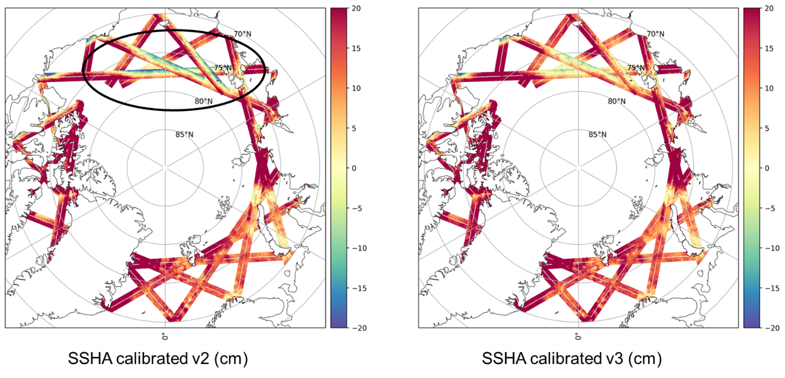

    Example of calibrated SSHA in v2 (left) and V3 (right) product version
    (KaRIn cycle 9, passes 1-29). The black circle shows an area where
    calibration residual errors were high in V2. There are significantly reduced
    in V3.

.. note::

    The improvements introduced in version 3 are intended to reduce the
    absorption of physical signals of interest by calibration corrections in the
    marginal regions. Nevertheless, the calibration process may still
    inadvertently absorb signals other than systematic KaRIn errors, which could
    continue to affect the physical signal of interest. The low frequency
    calibration component is available in the new technical product, enabling
    users to assess the impact of the calibration elements and selectively apply
    those relevant to specific applications.

.. note::

    The calibration correction presents a discontinuity linked to the residual
    biaises observed between Copernicus Marine Service L3 nadir products
    available in delayed time (MY DT-2024 series) and in Near Real Time

.. _denoising_improvement:

Denoising improvement
:::::::::::::::::::::

The 2 km denoising process was enhanced to reduce residual anomalies observed in
the V2 product version. Improvements to the U-net learning process includes:

- Incorporating more realistic L3 editing in the simulated dataset
- Simplifying the training dataset in size and by going back on
  style-transferred noise
- Using a slower learning process, with appropriate parameters

Additionally, metrics to qualify the denoised SSHA were improved. The new V3
denoising process eliminates noise signals considered as mainly uncorrelated.
It also substantially reduces the artifacts observed in the V2 version,
including:

- No regional biases introduced in the SSHA
- Significantly reduced absorption of physical signals at short wavelengths
- Greatly diminished discontinuities in the SSHA signal caused by denoising

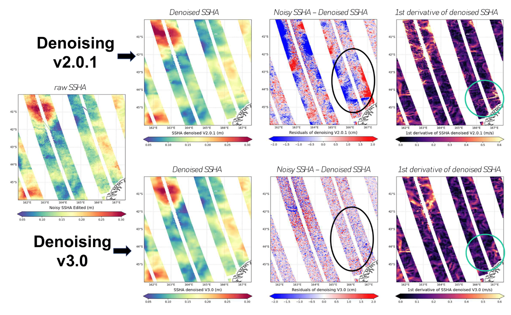

    Example of denoised SSHA. The original raw (noisy) SSHA is shown on the left
    map. The denoised SSHA, the residual noise removed, and the first derivative
    of the denoised SSHA are presented in the three successive columns to the
    right, for version V2 (top) and version V3 (bottom) of the denoising
    process. The black circle highlights areas where regional biases were
    introduced by V2 (notably in regions of high SWH). The green circle
    indicates areas where SSHA discontinuities — clearly visible in the first
    derivative — were introduced in V2 denoising.

.. note::

    The denoising process may still absorb signals other than uncorrelated
    noise. Residual small-scale wave signals and some MSS-related errors can be
    observed in the removed component. Users interested in wave signals, or
    those intending to combine SSHA with an MSS field different from the one
    used in the L3 processing, should work with SSHA prior to denoising

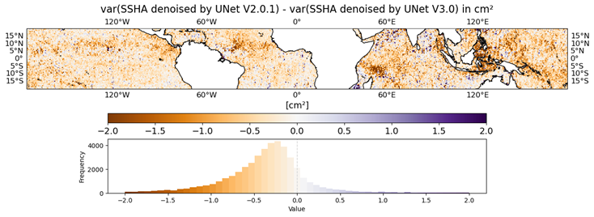

    Mapping of difference of SSHA denoised variance between the SSHA denoised by
    the algorithm in V2.0.1 and the one in V3.0. Orange means that the SSHA
    denoised by the UNet V3.0 contains more variability (i.e. absorbing less
    signal) than in V2.0.1. We made the focus on the equatorial band where
    internal tides are well-known

Geostrophic current estimation improved
:::::::::::::::::::::::::::::::::::::::

In version V3, the methodology for estimating geostrophic currents has been
refined by integrating the 2D spline filtering technique proposed by (Tranchant
et al. 2025). This approach enables selective filtering of short-wavelength
signals that may include unbalanced motions inconsistent with the geostrophic
approximation. The geostrophic velocity are then computed from the slope of the
linear plane kernel fitted to 2D SSH observations Compared to V2, the resulting
current fields are notably smoother.

Validation with independent drifter measurements confirms improved agreement,
with KaRIn-derived geostrophic currents demonstrating stronger consistency.
Notably, the Level-3 fitting method reduces the root mean square deviation
(RMSD) by 10-20%, underscoring enhanced performance.

.. figure:: changes_3.0.0_currents.png
    :align: center
    :width: 300

    Intercomparison RMSD Karin velocity vs drifter velocity as a function of
    drifter velocity amplitude. Left: comparison between KaRIn currents
    available in v2.0.1 and drifters (units cm.s-1); right: differences of RMSD
    when Karin v3 KaRIn currents are considered (units: %)

Technical
---------

The L3 v3 KaRIn product is complemented by a Technical dataset. Its purpose is
to provide access to additional geophysical parameters that may be relevant for
targeted studies or specialized applications. This product may also include
alternative solutions to core L3 outputs, particularly for variables not yet
available in the Level-2 dataset.

The content of this new product can be consulted at :doc:`../content`

Goddard Ocean Tide GOT5.6
:::::::::::::::::::::::::

Goddard Ocean Tide (GOT5.6) is a new model proposed by (Ray 2025). It provides
estimates of the amplitudes and phases of daily and sub-daily global ocean
tides, derived from decades of radar altimetry data across multiple satellite
missions. Over the majority of the deep ocean, between latitudes ±66°, the
solution primarily relies on data from five satellites: TOPEX/Poseidon, Jason-1,
Jason-2, Jason-3, and Sentinel-6A Michael Freilich. In contrast, data from
additional satellite altimeters were incorporated for shallow seas and polar
regions.

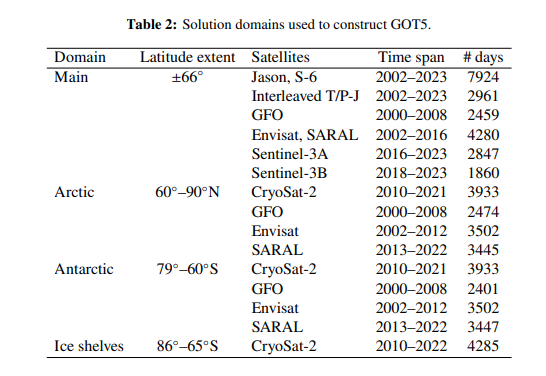

    Solution domains used to construct GOT5 from (Ray 2025)

Tidal analysis was conducted with respect to a prior reference model—mainly the
Finite Element Solution FES2014 from Lyard et al. (2021) — with minor localized
modifications.

Validation was performed using independent observations from several missions:
Sentinel-6A, Sentinel-3A, HY2B, and SWOT nadir. An example of the comparative
results is presented in the following figure, revealing that:

- GOT5.6 yields greater variance reduction than FES2022b across most of the
  global ocean, though local variability is observed. The strongest improvements
  are found along the northern Australian coastline, in the Sea of Okhotsk, the
  South China Sea, and the northern Indian Ocean.
- FES2022b achieves superior variance reduction in certain regions, including
  the Patagonian shelf, Bering Strait, Greenland Sea, and North Sea.
  Additionally, FES2022b performs better in coastal proximity, notably within 20
  km of the shoreline

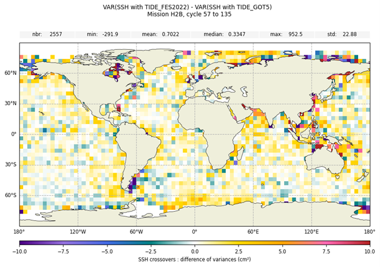

    Difference of variance of SSH differences at HaiYang-2B crossover locations,
    when SSH is corrected from ocean tide with FES22 or with GOT5.6 model.
    (courtesy L. Carrere) (unit cm²)

Internal tide Zhao30y
:::::::::::::::::::::

ZHAO30yr is an internal tide model developed by (Zhao 2025), utilizing 30 years
of satellite sea surface height (SSH) measurements spanning 1993 to 2022,
processed using an enhanced mapping technique. As a next-generation model,
ZHAO30yr decomposes the internal tide field and reveals numerous long-range
internal tidal beams, which carry key information on the processes of
generation, propagation, and dissipation. The ZHAO30yr atlases are available for
the eight principal tidal constituents: M2, K1, S2, O1, N2, K2, P1, and Q1.

The ZHAO30yr internal tide model was evaluated in comparison with the HRET22
model, which is currently used in L3 KaRIn product generation, using SWOT-nadir
observations. Results indicate that ZHAO30yr yields modest local variance
reduction relative to HRET22 across tropical oceans, with more pronounced
improvements observed east of Madagascar and throughout the Indonesian seas.
Conversely, ZHAO30yr increases variance locally in several regions, including
south of Japan, east of Australia, northern Indian Ocean, and west of
Madagascar. Overall, the mean variance difference between the two models is
minimal, estimated at just 0.03 cm²

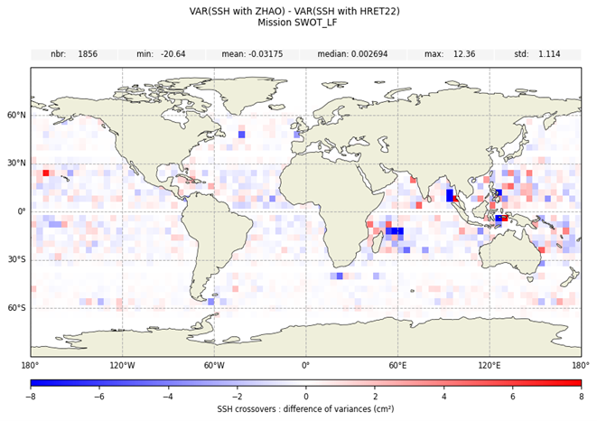

    Difference of variance of SSH differences at SWOT-nadir crossover locations
    over the [2023, 2024] period, when SSH is corrected from internal tide with
    ZHAO30y or with HRET22 model. (courtesy L. Carrere) (unit cm²)

Internal tide MIOST-IT24
::::::::::::::::::::::::

MIOST-IT24 is an internal tide model developed by (Tchilibou et al. 2025). It
reconstructs the sea surface height (SSH) signature of coherent internal tides
using a single-time inversion of a 28-year (1993–2020) along-track altimetry
dataset. Leveraging a conjugate gradient algorithm, this single inversion
approach simultaneously resolves internal tide contributions and mesoscale eddy
variability—an advancement over conventional methods that rely on separate
mesoscale estimates.

In contrast to its predecessor, MIOST-IT22 (Ubelmann et al. 2022), MIOST-IT24
incorporates mode-1 and mode-2 internal tide wavelengths computed from vertical
stratification profiles provided by the GLORYS12v1 climatology (1993–2020).
Atlases from MIOST-IT24 are available for four primary tidal constituents: M2,
K1, S2, and O1.

MIOST-IT24 was evaluated against the HRET22 model, currently used in Level-3
KaRIn product generation, using SWOT-nadir observations. The results indicate
that MIOST-IT24 generally outperforms HRET22, showing notable local variance
reductions, particularly across the Indonesian region. However, slight
degradation in performance is observed in some areas within the tropical band.

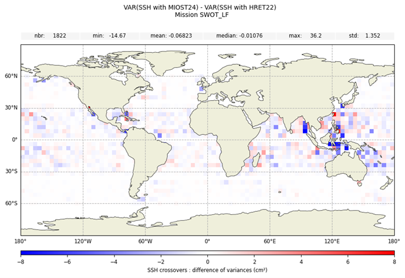

    Difference of variance of SSH differences at SWOT-nadir crossover locations
    over the [2023, 2024] period, when SSH is corrected from internal tide with
    MOST-IT24 or with HRET22 model. (courtesy L. Carrere) (unit cm²)

Rain flagging and Precipitation rate (ITU 2025 & RF 2025)
:::::::::::::::::::::::::::::::::::::::::::::::::::::::::

Two different precipitation rate models, presented in (Picard et al. 2025) are
proposed:

- ITU 2025: This solution relies on physically based attenuation inversion using
  ITU-R models. It appears to be the more robust approach under extreme event
  conditions, but exhibits over-detection of precipitation rates in low-rain
  scenarios. Thresholds derived from FLUCTUS 2025 are used to define the
  precipitation flag included in the Technical product
- RF 2025: This model is based on a supervised machine learning algorithm
  trained on collocated NEXRAD radar data. It performs better in detecting low
  precipitation rates but introduces discontinuities in the estimated
  precipitation field due to the segmentation scheme used during processing

Low frequency calibration
:::::::::::::::::::::::::

The objective of the calibration is to remove systematic errors from the
satellite: uncorrected satellite roll angle, interferometric phase biases and
thermo-elastical distortions in the instrument baseline and antennas. In
practice, the calibration also absorbs residues of geophysical correction errors
such as tide or SSB. In the technical product, a low-frequency calibration is
provided. This is an alternative calibration that corrects the satellite's
systematic errors less well but absorbs fewer residues of geophysical correction
errors. In the following figure, we can see that there are fewer tidal residues
absorbed in the v3.0 calibration but especially in the v3.0 low-frequency
calibration.

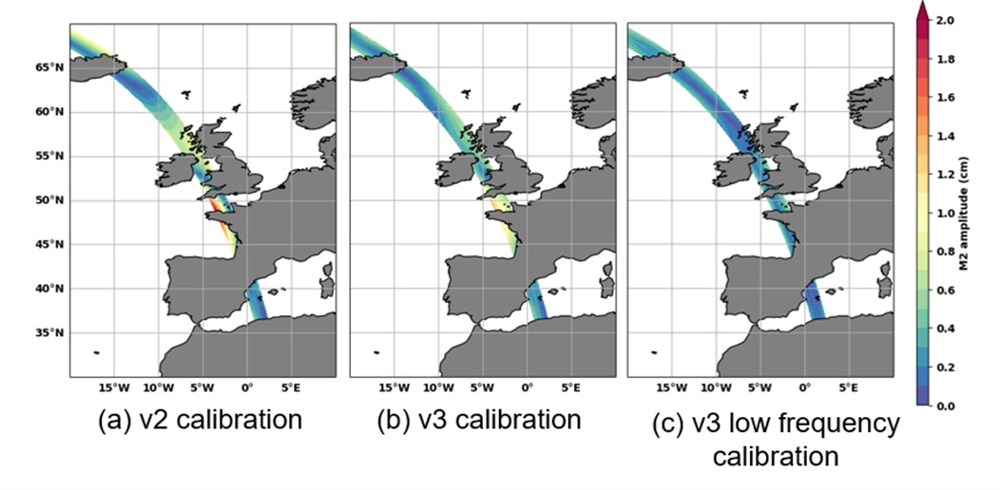

    M2 amplitude in the v2, v3 and v3 low frequency calibrations for pass 348
    (cm)
