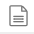

Contents
********

..
  The HTML files have been generated by loading a partition of the L3 collection
  or a netcdf file in a xarray dataset and converting the notebook in HTML using
  jupyter nbconvert --to html --no-input <FILE>.ipynb
  Note that the variables are sorted twice with the prefix and then
  alphabetically
  https://docs.xarray.dev/en/stable/generated/xarray.set_options.html allows
  enabling the default collapse of all sections

This chapter gives examples of the content for each dataset and format. They are
presented as an HTML representation of xarray Dataset, so it is possible to
directly consult the fields metadata by uncollapse the **Data variables**
Section of the widget, and clicking on |ico| to display the attribute of a
variable

Getting knowledgeable about the different Level-3 Sea Level Anomalies and their
associated corrections can be tricky. The following table is a good start for
differenciating the calibrated, edited and filtered fields. An ``X`` in the
column indicates that the process is applied to the field.

.. list-table::
  :header-rows: 1

  * - SLA field (netcdf)
    - calibrated
    - edited
    - filtered
  * - ssha_unedited
    - X
    -
    -
  * - ssha_unfiltered
    - X
    - X
    -
  * - ssha_filtered
    - X
    - X
    - X

Netcdf
------

.. tabs::

  .. tab:: V3.0.0

    .. tabs::

      .. tab:: Basic

        .. raw:: html
          :file: fields/3.0.0_basic.html

      .. tab:: Expert

        .. raw:: html
          :file: fields/3.0.0_expert.html

      .. tab:: Technical

        .. raw:: html
          :file: fields/3.0.0_technical.html

  .. tab:: V2.0.1

    .. tabs::

      .. tab:: Basic

        .. raw:: html
            :file: fields/2.0.1_basic.html

      .. tab:: Expert

        .. raw:: html
            :file: fields/2.0.1_expert.html

      .. tab:: Unsmoothed

        .. raw:: html
            :file: fields/2.0.1_unsmoothed.html
