Known limitations and anomalies
===============================

We list in this section the known limitations or anomalies observed in the L3
KaRIn products

.. _osm-mask-limitation:

Missing estuaries in land-sea mask
++++++++++++++++++++++++++++++++++

Some areas (especially estuaries) are not well defined in OpenStreetMap and will
show land where we would expect sea.

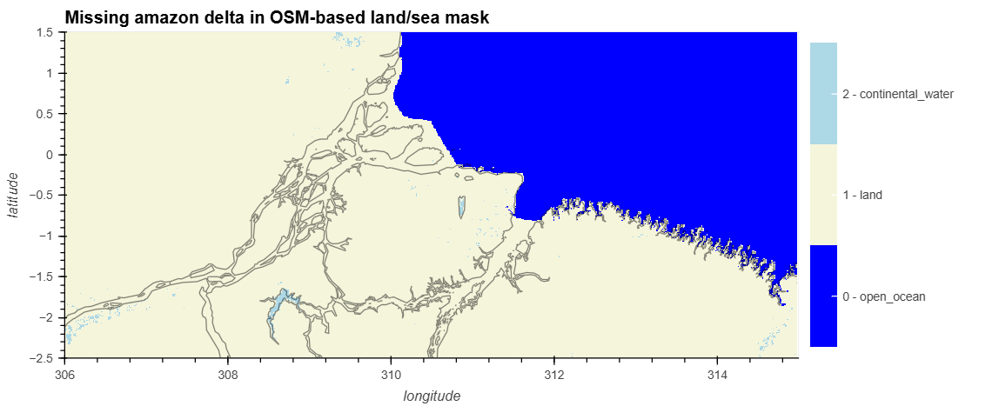

This issue has been mitigated:

- In :ref:`V2.0<osm-mask-improvement>` by blending the L2 mask over the
  identified problematic areas, which include 43 estuaries. Additionnal
  problematic areas spotted by the users might be communicated to
  aviso-swot@altimetry.fr for further patching.
- In :ref:`V3.0<osm-auto-mask-improvement>` by introducing a new land-sea mask
  selection criterion

Internal Tide Discontinuity around 0°E
++++++++++++++++++++++++++++++++++++++

- Affected version: ``3.0.0``
- Affected subsets: ``Technical``

The internal tide projection of `Zhao, 2025 <https://doi.org/10.5194/essd-17-3949-2025>`_
shows a discontinuity around longitude 0. This should be fixed in subsequent
versions

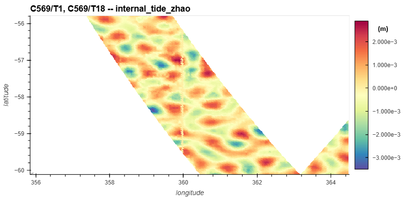

Discrepancy of valid domains for FES22 corrections in v2.0 and v2.0.1
+++++++++++++++++++++++++++++++++++++++++++++++++++++++++++++++++++++

In some particular areas, users might observe that some of Level-3 data is
missing with respect to Level-2 data, and that the quality flag investigation is
marked as ``no_data``

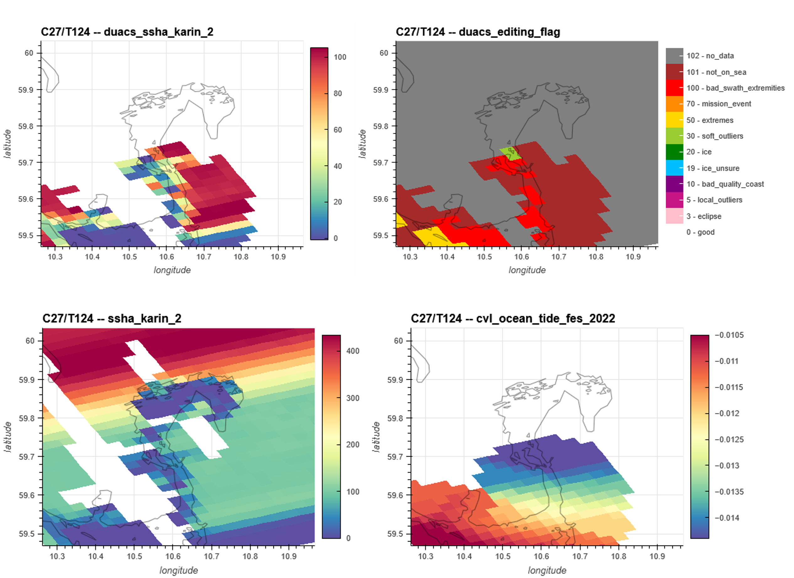

   Missing points in L3 are observed when comparing the Sea Level Anomaly from
   Level-3 (top left) and Level-2 (bottom left) products. The quality flag (top
   right) indicates missing data in gray that are explained by missing data in
   the ocean tide correction (bottom right)

The missing data is introduced by the ocean tide correction FES 2022, which is
not defined at the problematic location. Even if the ocean tide correction is
the same in both the baseline C Level 2 product and the v2.0.1 Level 3 product,
the source of the correction differs. Level-2 product uses an extrapolated
cartesian grid whereas the Level-3 product uses the finite element meshes which
has a smaller domain of definition. This is illustrated in the following figure:

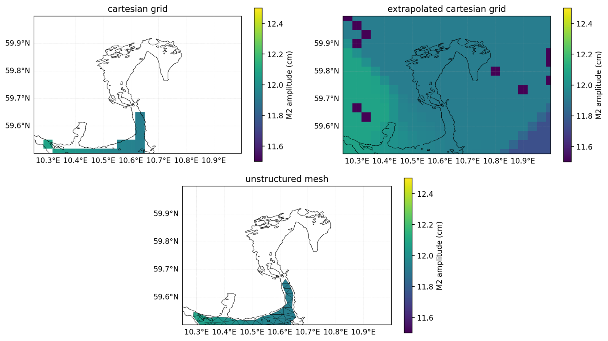

   Difference in the definition of the FES2022 source data with (bottom) the
   original unstructured mesh used in the Level-3 product (top left) the
   cartesian grid interpolated from the mesh and (top right) the extrapolated
   cartesian grid used in the Level-2 product

This issue was mitigated in :ref:`V3.0<blend-fes>` by using the FES22 solution
from extrapolated cartesian grid when the unstructured mesh solution is not
available.

Use of ``ssha_filtered`` and MSS in V2.0 and V2.0.1
+++++++++++++++++++++++++++++++++++++++++++++++++++

The analysis of the constant content of the noise removed with the filtering can
underline statics small scales structures linked to the MSS field used for the
SSHA computation (see example in the following figure). Consequently, we
recommend to users that may want to use a different MSS field than the one used
in the L3 processing to work with the “ssha_unfiltered” field (i.e. before
denoising processing) rather than “ssha_filtered” (i.e. after denoising
processing)

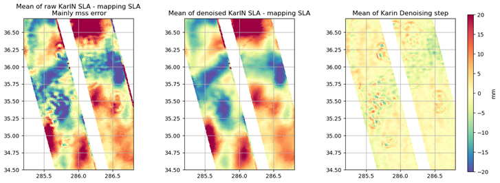

``ssha_filtered`` biases and discontinuities in v2.0 and V2.0.1
+++++++++++++++++++++++++++++++++++++++++++++++++++++++++++++++

Regional biases in the ssha_filtered product were observed, primarily in areas
of high SWH, where they can reach several centimeters. These biases are
identified as anomalies introduced during the denoising process and are likely
due to limitations in the current noise-modeling scheme. These biases are also
visible in regions of strong variability, such as the Gulf Stream. The denoising
versions V2.0 and V2.0.1 can absorb part of the oceanic structures and sometimes
even amplify them. These biases can be so strong that they create a
discontinuity in the predicted swaths (see following figure, purple circle).

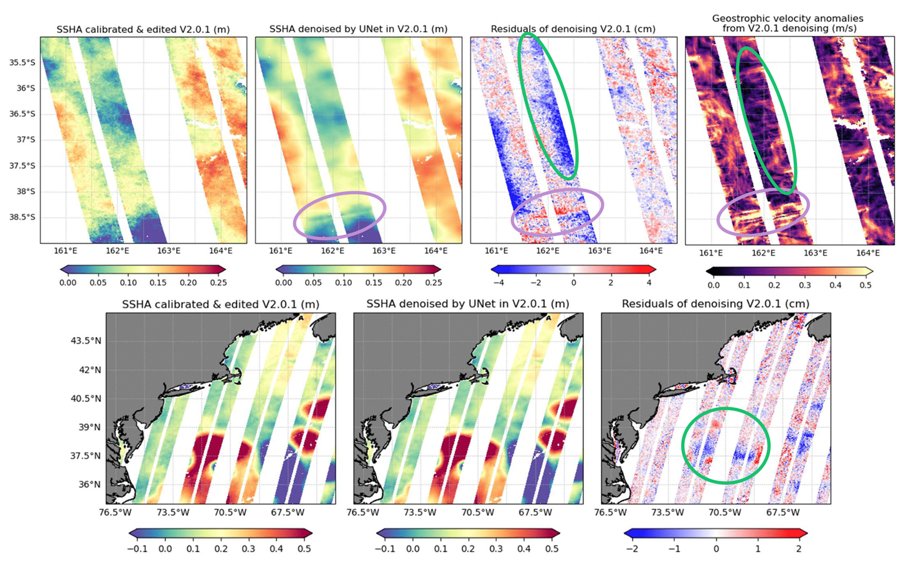

   Example of regional biases induced by denoising processing in v2

Certain physical structures may be attenuated by the denoising process
implemented in version V2, particularly those associated with short-wavelength
wave signals. This phenomenon is illustrated in the following figure, where
notable smoothing and signal loss are observed.

.. figure:: anomalies_2.0.0_filtering_attenuation.png
   :align: center

   Example of waves attenuated by denoising processing in v2

These issues were mitigated in :ref:`V3.0<denoising_improvement>` by using an
improved denoising

SSHA restrictive quality flag during extreme events in v2.0 and V2.0.1 : Example of Hurricane Milton
++++++++++++++++++++++++++++++++++++++++++++++++++++++++++++++++++++++++++++++++++++++++++++++++++++

The cycle 22, pass 216 intersects with the path of Hurricane Milton. Some pixels
are rejected with flag #30 (SSHa pixels out of the expected statistical
distribution) and #5 (SSHa pixels out of local distribution). This is mainly due
to rain cells. For scientists who want to work on the Hurricane or on similar
cases, we suggest applying flags higher than 30 (quality_flag variable) on the
ssha_unedited variable.

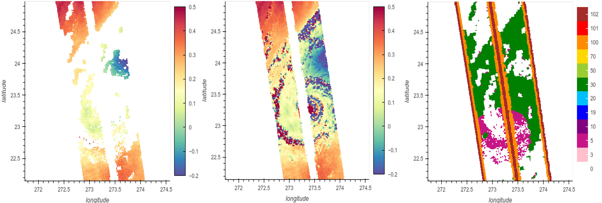

   Example of Hurricane Milton. Left: ssha variable i.e. ssha with all flags
   applied. Middle: ssha with only flags > 30 applied. Right: quality flag

Small-scale discontinuities and errors in the calibration variable
++++++++++++++++++++++++++++++++++++++++++++++++++++++++++++++++++

- Affected versions: ``All``
- Affected subsets: ``All``

In some areas, when a L2 field (sc_yaw) is not defined, some small-scale terms
of the calibration are reverted. This inversion causes small-scale
discontinuities and errors inside the calibration variable. As these
discontinuities and errors are small-scale, they are only visible if the
calibration mean is removed. This issue only occurs when SSHA is not defined,
thus this issue does not affect SSHA.

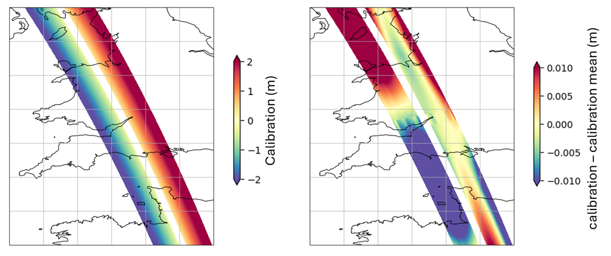

Wrong editing flag in Unsmoothed product during eclipse transition
++++++++++++++++++++++++++++++++++++++++++++++++++++++++++++++++++

Some eclipse transitions in the Unsmoothed product are flagged with flag 30
instead of flag 3. These eclipses are not kept in the edited and filtered SSHA.
There is therefore inhomogeneity between the Expert and Unsmoothed products.

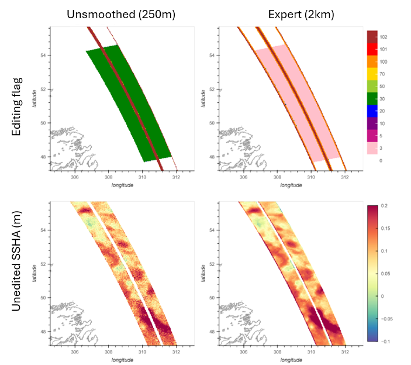

   Example of eclipse transition with inhomogeneous flags between Expert and
   Unsmoothed products

Wrong wave crest editing
++++++++++++++++++++++++

Some soliton waves have a wrong editing. A visual check shows that the
non-edited data seems normal, but the wave's crest is still flagged as outside
the expected Sea Surface Height distribution. Users can switch to the
``duacs_ssha_karin_2_calibrated`` variable and tune the diting following this `tutorial <https://swot-science-team.pages.cnes.fr/cls/helpdesk-aviso-swot/internal_doc/tutorials/auto_tutorials/advanced/ex_editing_flags.html#sphx-glr-tutorials-auto-tutorials-advanced-ex-editing-flags-py>`_

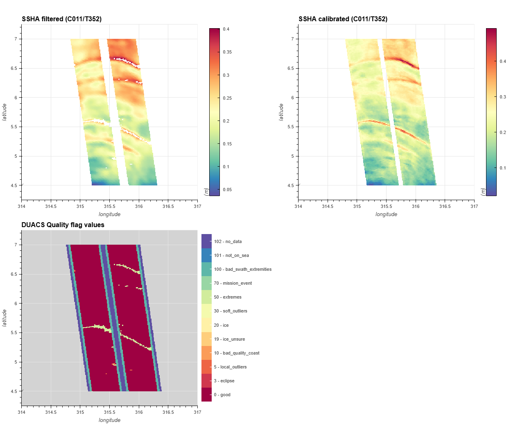

SSHA calibration discontinuity
++++++++++++++++++++++++++++++

- Affected versions: ``3.0.0``
- Affected subsets: ``All``

The calibration correction presents a discontinuity related with the residual
biases observed between Copernicus Marine Service L3 nadir products available in
delayed time (MY DT-2024 series) and in Near Real Time (NRT). Indeed, for
version 1.0.2 and 2.0.1, the KaRIn L3 data were calibrated from the Copernicus
Marine Service L3 nadir products available in NRT. For version 3.0, an upgrade
has been made in order to use L3 nadir MY products when available. The
Copernicus Marine Service L3 nadir products based on MY DT-2024 standard are
available in delayed time until May 2024 and, then in NRT after that date. Time
evolving global and regional biases exist between L3 nadir MY and NRT series.

The following figure (left) illustrates the biases observed between L3 nadir MY
and NRT series used for the L3 KaRIn v3 calibration. These biases propagate into
the KaRIn calibration results as illustrated in the figure (right).

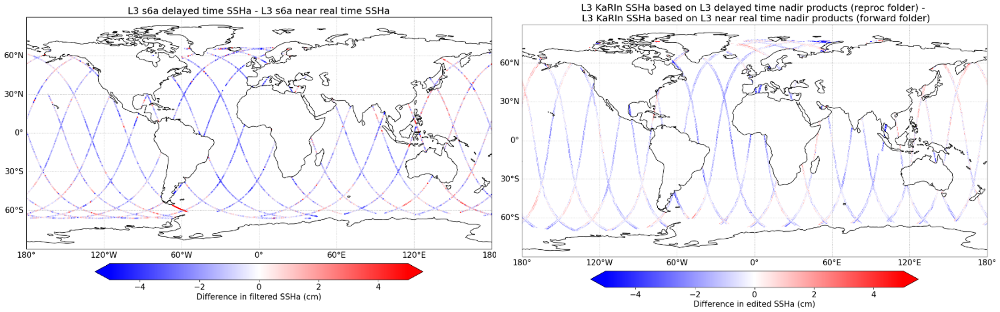

   Bias between L3 s6a delayed time and near real time SSHa and its impacts on
   L3 KaRIn reproc and forward SSHA for the day of 2024/05/20

To differentiate between the two calibration periods (based on L3 nadir MY or
NRT), the L3 v3 KaRIn products are distributed in two separate directories:

- The ``reproc`` directory which contains L3 KaRIn products calibrated from the
  Copernicus Marine Service L3 nadir products available in delayed time (MY
  DT-2024 series)
- The ``forward`` directory which contains L3 KaRIn products calibrated from the
  Copernicus Marine Service L3 nadir products available in NRT (DT-2024
  standards)

.. figure:: anomalies_3.0.0_reproc_forward_diagram.png
   :align: center
   :width: 800

   Impact diagram of L3 nadir inputs on L3 KaRIn products

HRET22 limitation in v2 and v3
++++++++++++++++++++++++++++++

Some problems with the blending of HRET14 and HRET8.1 have been detected. They
are especially apparent when considering the non-M2 constituents and are
generally at the mm-amplitude level, but involve non-physical-looking wave
patterns that arise from the blending. Actions are on going to solve the
problems in a future version of HRET model.

In the meanwhile, users who observe some of these issues can use the Technical
product to apply an alternative internal wave correction provided in this
product (MIOST-IT24 and Zhao30y).

Along-track lines in V2 and in V3
+++++++++++++++++++++++++++++++++

As underlined by (Chen et Chen 2025), KaRIn on-board processor (OBP) is
implemented using electronic field-programmable gate array (FPGA) chips that are
somewhat susceptible to upset by ionizing radiation in space. An ionizing
particle may cause one or more binary bits to be erroneously flipped. This is
called a single event upset (SEU). This occurs at random times due to the
radiation environment in low-Earth orbit. These phenomena start abruptly (but
may start over land) and end when the on-board processor automatically resets
itself to clear radiation corruption (“FPGA reconfig”). These anomalies remain
visible in the L3 products, with a signature modified by the different
processing steps. An example is shown in the following figure for LR 2km data

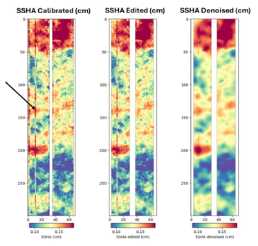

   Impact of SEU event on L3 SSHA

We counted on phase SCIENCE the cycles and passes impacted. The list might not
be complete:

* Cycle 3, Tracks 365 to 367
* Cycle 5, Tracks 478-479
* Cycle 6, Track 66
* Cycle 10, Tracks 33 to 39
* Cycle 12, Tracks 217 to 220
* Cycle 22, Tracks 218 to 221
* Cycle 32, Track 115
* Cycle 34, Track 171
* Cycle 35, Track 171

Unrealistic gradient dynamics on swaths border in case of large scale oceanic features
++++++++++++++++++++++++++++++++++++++++++++++++++++++++++++++++++++++++++++++++++++++

In V3.0 and previous versions, the computation of SSHA gradients (i.e.
geostrophic velocities and relative vorticity) can lead to small errors on
outside borders of the swath. This occurs especially when large-scale oceanic
features are cut by the SWOT track. This issue is NOT related to denoising which
performs as usual. It is related to the gradient computation method itself (e.g.
stencil or 2D spline fitting, see section 2.7) that is struggling near borders.
A different derivation method will lead to different results (see the following
figure). Feel free to contact AVISO service desk if you use your own approach
that you find more appropriate than the implemented ones, we would be delighted
to implement it in the next products. We recommend the user to be careful when
interpreting near swaths border relative vorticity with a linear and horizontal
pattern as illustrated.

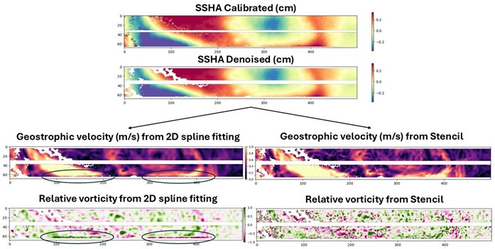

   Errors of relative vorticity on swath border after 2D spline fitting
   derivation method that we do not see using Stencil (but it can occurs with
   stencil too)

Bias anomaly caused by L3 calibration in passes parallel to the coast
+++++++++++++++++++++++++++++++++++++++++++++++++++++++++++++++++++++

The L3 calibration parameters are calculated only for fully defined across-track
lines. Passes parallel to the coastline include across-track lines that are not
fully defined, for which the calibration parameters are not calculated but
interpolated. This interpolation can cause locally degraded results,
particularly for the bias parameter. In the next figure, we can see that at the
crossover, there is a strong bias between the two passes, resulting from a bias
problem on the pass parallel to the coast.

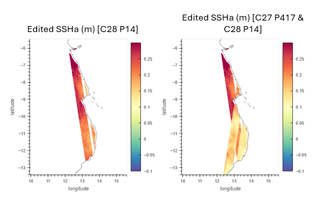

   Bias anomaly for a pass parallel to the coast
