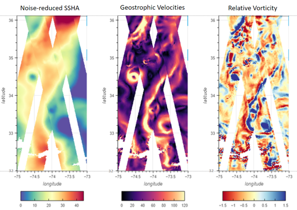

Overview
========

The Level-3 (L3) products are formally part of the Science Team Project `DESMOS <https://www.aviso.altimetry.fr/fileadmin/documents/missions/Swot/SWOT-DESMOS2-Summary.pdf>`_
and funded by the French Early Adopter Program (i.e. PIA). Those products are
lightweight, simple, and usable out-of-the-box; moreover, Nadir altimeter &
KaRIn measurements are displayed in one single image.

The Value-added compared to SWOT L2 KaRIn (L2_LR_SSH) products are:
  * State of the art research-grade upgrades (incl. very recent & submitted
    papers)
  * Multi-mission calibration (SWOT is consistent with other altimeters)
  * Noise-mitigation for SSHA derivatives (experimental, AI-based)
  * Pre-made sophisticated editing procedure KaRIn and nadir instruments blended
    into a single image
  * L3 has new layers (optional) that can blend with L2 fields

  Example of SSHA (after noise reduction) (left), geostrophic velocities
  (middle) and relative vorticity (right) obtained with SWOT measurements
  contained in the SWOT L3 KaRIn ocean product

4 types of files are distributed: Basic, Expert, Technical and Unsmoothed
  * Basic L3_LR_SSH includes only SSHA (Sea Surface Height Anomaly) and mean
    dynamic topography (MDT) on the 2km KaRIn grid
  * Expert L3_LR_SSH includes the backscatter coefficient (sigma0), the mean sea
    surface (MSS) and geostrophic currents (absolute and anomalies) in addition to
    SSHA and mean dynamic topography (MDT). It also integrates algorithms,
    corrections and external models as separate layers. It is available on the
    2km KaRIn grid
  * Technical L3_LR includes additional parameters and geophysical fields that
    may be of interest for certain applications or that provides an alternative
    solution to those used in the core (Basic/Expert) datasets. It is available
    on the 2 km KaRIn grid
  * Unsmoothed L3_LR_SSH includes the MSS, MDT and geostrophic currents (absolute
    and anomalies) in addition to the SSHA and MDT on the 250-m KaRIn native grid.
    Like the Expert subproduct, it also integrates a quality flag, corrections and
    external models as separate layers

.. note::

  The Expert dataset includes all the Basic dataset content

.. _releases:

Releases
--------

.. table::

    +---------+------------+-------------------------+
    | Version |  Dataset   |       Release date      |
    +=========+============+=========================+
    |         |   Expert   |      November 2025      |
    |  V3.0   +------------+-------------------------+
    |         | Technical  |      December 2025      |
    +---------+------------+-------------------------+
    |         |   Expert   |                         |
    | V2.0.1  +------------+        March 2025       |
    |         | Unsmoothed |                         |
    +---------+------------+-------------------------+
    | V2.0.0  |   Expert   |    27th January 2025    |
    +---------+------------+-------------------------+
    |         | Unsmoothed |    18th October 2024    |
    | V1.0.2  +------------+-------------------------+
    |         |   Expert   |   17th September 2024   |
    +---------+------------+-------------------------+
    | V1.0.1  | Unsmoothed |     28th June 2024      |
    +---------+------------+-------------------------+
    |         | Unsmoothed |      14th June 2024     |
    |  V1.0   +------------+-------------------------+
    |         |   Expert   | | 3rd June 2024 (daily) |
    |         |            | | 13th May 2024         |
    +---------+------------+-------------------------+
    |   V0.3  |   Expert   |    9th January 2024     |
    +---------+------------+-------------------------+

Temporal coverage
-----------------

The following table shows the temporal coverage of the L3_LR_SSH products.
Coverage may differ between the Expert and Unsmoothed datasets. Some holes in
the time series are due to missing L2_LR_SSH data or constraints on the Level-3
production. See the associated version notes for more details.

.. tabs::

  .. tab:: V3.0.0

    .. list-table::
        :header-rows: 1

        * -
          - Basic/Expert/Technical
        * - | CalVal phase
            | (1-day)
          - | C474/T003 - C578/T004
            | 28th March 2023 – 10th July 2023
        * - | Science phase
            | (21-days)
          - | C001/T149 - now
            | 26th July 2023 – now

  .. tab:: V2.0.1

    .. list-table::
        :header-rows: 1

        * -
          - Basic/Expert
          - Unsmoothed
        * - | CalVal phase
            | (1-day)
          - | C474/T003 - C578/T004
            | 28th March 2023 – 10th July 2023
          - | C474/T003 - C578/T004
            | 28th March 2023 – 10th July 2023
        * - | Science phase
            | (21-days)
          - | C001/T149 - C041/T452
            | 26th July 2023 – 17th November 2025
          - | C001/T149 - C029/T379
            | 26th July 2023 – 9th March 2025

  .. tab:: V2.0

    .. list-table::
        :header-rows: 1

        * -
          - Basic/Expert
          - Unsmoothed
        * - | CalVal phase
            | (1-day)
          - | C474/T003 - C578/T004
            | 28th March 2023 – 10th July 2023
          - Not Applicable
        * - | Science phase
            | (21-days)
          - | C001/T149 - C029/T127
            | 26th July 2023 – 28th February 2025
          - Not Applicable

  .. tab:: V1.0.2

    .. list-table::
        :header-rows: 1

        * -
          - Basic/Expert
          - Unsmoothed
        * - | CalVal phase
            | (1-day)
          - | C474/T003 - C578/T004
            | 28th March 2023 – 10th July 2023
          - | C474/T003 - C578/T004
            | 28th March 2023 – 10th July 2023
        * - | Science phase
            | (21-days)
          - | C001/T149 - C027/T091
            | 26th July 2023 – 16th January 2025
          - | C001/T149 - C016/T554
            | 26th July 2023 – 17th June 2024

  .. tab:: V1.0.1

    .. list-table::
        :header-rows: 1

        * -
          - Basic/Expert
          - Unsmoothed
        * - | CalVal phase
            | (1-day)
          - | C474/T003 - C578/T004
            | 28th March 2023 – 10th July 2023
          - | C474/T003 - C578/T004
            | 28th March 2023 – 10th July 2023
        * - | Science phase
            | (21-days)
          - | C001/T149 - C017/T557
            | 26th July 2023 – 8th July 2024
          - | C001/T149 - C006/T584
            | 6th September 2023 – 23th November 2023

  .. tab:: V1.0

    .. list-table::
        :header-rows: 1

        * -
          - Basic/Expert
          - Unsmoothed
        * - | CalVal phase
            | (1-day)
          - | C474/T003 - C578/T004
            | 28th March 2023 – 10th July 2023
          - | C474/T003 - C578/T004
            | 28th March 2023 – 10th July 2023
        * - | Science phase
            | (21-days)
          - | C001/T149 - C017/T557
            | 26th July 2023 – 8th July 2024
          - | C001/T149 - C006/T584
            | 6th September 2023 – 23th November 2023

  .. tab:: V0.3

    .. list-table::
        :header-rows: 1

        * -
          - Basic/Expert
          - Unsmoothed
        * - | CalVal phase
            | (1-day)
          - | C474/T007 - C578/T002
            | 29th March 2023 – 10th July 2023
          - N/A
        * - | Science phase
            | (21-days)
          - | C003/T170 - C006/T544
            | 6th September 2023 – 21th November 2023
          - N/A

Data policy and condition of use
--------------------------------

The SWOT L3 KaRIn ocean product is available free of charge for scientific
studies and commercial activities.

How to cite
-----------

Publications should include the following statement in the Acknowledgments

Citation Basic L3_LR_SSH
  "The SWOT_L3_LR_SSH product, derived from the L2 SWOT KaRIn Low rate ocean
  data products (L2_LR_SSH) (NASA/JPL and CNES), is produced and made freely
  available by AVISO and DUACS teams as part of the DESMOS Science Team
  project". AVISO/DUACS., 2023. SWOT Level-3 SSH Basic (v3.0) [Data set].
  CNES. https://doi.org/10.24400/527896/A01-2023.017

Citation Expert L3_LR_SSH
  "The SWOT_L3_LR_SSH product, derived from the L2 SWOT KaRIn low rate ocean
  data products (L2_LR_SSH) (NASA/JPL and CNES), is produced and made freely
  available by AVISO and DUACS teams as part of the DESMOS Science Team
  project". AVISO/DUACS, 2023. SWOT Level-3 SSH Expert (v3.0) [Data set].
  CNES. https://doi.org/10.24400/527896/A01-2023.018

Citation Technical L3_LR_SSH
  "The SWOT_L3_LR_SSH product, derived from the L2 SWOT KaRIn low rate ocean
  data products (L2_LR_SSH) (NASA/JPL and CNES), is produced and made freely
  available by AVISO and DUACS teams as part of the DESMOS Science Team
  project". AVISO/DUACS, 2023. SWOT Level-3 SSH Technical (v3.0) [Data set].
  CNES. https://doi.org/10.24400/527896/A01-2025.009

Citation Unsmoothed L3_LR_SSH
  "The SWOT_L3_LR_SSH product, derived from the L2 SWOT KaRIn low rate ocean
  data products (NASA/JPL and CNES), is produced and made freely available by
  AVISO and DUACS teams as part of the DESMOS Science Team project".
  AVISO/DUACS, 2024. SWOT Level-3 KaRIn Low Rate SSH Unsmoothed (v2.0.1) [Data
  set]. CNES. https://doi.org/10.24400/527896/A01-2024.003

Bibliography
------------

Arbic, Brian K., Robert B. Scott, Dudley B. Chelton, James G. Richman, et
Jay F. Shriver. 2012. « Effects of Stencil Width on Surface Ocean Geostrophic
Velocity and Vorticity Estimation from Gridded Satellite Altimeter Data ».
Journal of Geophysical Research: Oceans 117 (C3): 2011JC007367.
https://doi.org/10.1029/2011JC007367.

Cartwright, D. E., et Anne C. Edden. 1973. « Corrected Tables of Tidal Harmonics
». Geophysical Journal International 33 (3): 253-64.
https://doi.org/10.1111/j.1365-246X.1973.tb03420.x.

Cartwright, D. E., et R. J. Tayler. 1971. « New Computations of the
Tide-generating Potential ». Geophysical Journal International 23 (1): 45-73.
https://doi.org/10.1111/j.1365-246X.1971.tb01803.x.

Charayron, R., P. Schaeffer, M. Ballaritta, et al. 2025. « Blending Data from
SWOT KaRIn Science Phase and 30 Years of Nadir Altimetry to Improve Mean Sea
Surface Models ». Oral presentation. EGU General Assembly 2025, Vienna, Austria,
April 30. https://meetingorganizer.copernicus.org/EGU25/EGU25-8570.html.

Chou, Min-Yang, Jia Yue, Jack Wang, J. D. Huba, Mostafa El Alaoui, Maria M.
Kuznetsova, Lutz Rastätter, et al. 2023. « Validation of Ionospheric Modeled TEC
in the Equatorial Ionosphere During the 2013 March and 2021 November Geomagnetic
Storms ». Space Weather 21 (6): e2023SW003480.
https://doi.org/10.1029/2023SW003480.

Desai, Shailen, John Wahr, et Brian Beckley. 2015. « Revisiting the Pole Tide
for and from Satellite Altimetry ». Journal of Geodesy 89 (12): 1233-43.
https://doi.org/10.1007/s00190-015-0848-7.

Dibarboure et al., 2024, SWOT ST, SWOT Level-3 Overview and `link <https://swotst.aviso.altimetry.fr/fileadmin/user_upload/SWOTST2024/20240621/ocean/Fri_AM_Dibarboure_SWOTST_level3_202406_v1.pdf>`_
with L2 products

Jousset, S., et S. Mulet. 2020. « New Mean Dynamic Topography of the Black Sea
and Mediterranean Sea from altimetry, gravity and in-situ data ». Link to
`OSTST <https://ostst.aviso.altimetry.fr/fileadmin/user_upload/tx_ausyclsseminar/files/OSTST2020_JOUSSET_MULET_MDT.pdf.>`_
presentation

Jousset, S., S. Mulet, John Wilkin, Eric Greiner, G Dibarboure, et N Picot.
2022. « New global Mean Dynamic Topography CNES-CLS-22 combining drifters,
hydrological profiles and High Frequency radar data”, OSTST 2022 ».
https://doi.org/10.24400/527896/a03-2022.3292.

Jousset, Solène, Sandrine Mulet, Eric Greiner, et al. 2025. « New Global Mean
Dynamic Topography CNES-CLS-22 Combining Drifters, Hydrography Profiles and High
Frequency Radar Data ». ESS Open Archive, online preview.
https://doi.org/10.22541/essoar.170158328.85804859/v2.

Laloue, A, P Veillard, P Schaeffer, M-I Pujol, O. Andersen, D Sandwell, A
Delepoulle, G Dibarboure, et Y Faugere. 2024. « Merging recent Mean Sea Surface
into a 2023 Hybrid model (from Scripps, DTU, CLS and CNES) ».

Loren Carrère, Florend Lyard, Mathilde Cancet, Damien J. Allain, Ergane Fauchet,
Mei-Ling Dabat, Michel Tchilibou, Ramiro Ferrari, et Yannice Faugère. 2023. «
The new FES2022 Tidal atlas. Presented at the 2023 SWOT Science Team meeting
(Toulouse). Available online (last access: 19 April 2024):
https://doi.org/10.24400/527896/a03-2022.3287 ».

Lyard, F., L Carrere, M-L Dabat, M Tchilibou, E Fouchet, Y Faugere, G
Dibarboure, et N Picot. 2023. « Barotropic correction for SWOT: FES2022 and DAC
». `Link to SWOT-ST meeting, Toulouse <https://swotst.aviso.altimetry.fr/fileadmin/user_upload/SWOTST2023/20230921_ocean_3_tides/11h00-2_FES2022-DAC.pdf>`_

Picard, Bruno, Aurélien Colin, Aurélien Husson, et Gérald Dibarboure. 2025. The
Effects of Rain on a Ka-Band Swath Altimeter: Lessons Learned from the SWOT
Mission. April 10. https://eartharxiv.org/repository/view/8950/.

Ray, R. D. 2025. « Documentation for Goddard Ocean Tide Solution GOT5: Global
Tides from Multimission Satellite Altimetry”. NASA TM-20250002085, Goddard Space
Flight Center, Greenbelt, Maryland, USA ».
https://science.gsfc.nasa.gov/sed/content/uploadFiles/publication_files/GOT5-TechMemo.pdf.

Schaeffer, P., M-I Pujol, P Veillard, Y Faugere, Q Dagneaux, G Dibarboure, et N
Picot. 2023. « The CNES CLS 2022 Mean Sea Surface: Short Wavelength Improvements
from CryoSat-2 and SARAL/AltiKa High-Sampled Altimeter Data ». Remote Sensing
15 (11): 2910. https://doi.org/10.3390/rs15112910.

Tchilibou, Michel, Simon Barbot, Loren Carrere, Ariane Koch-Larrouy, Gérald
Dibarboure, et Clément Ubelmann. 2025. « M2 Monthly and Annual Mode 1 and Mode 2
Internal Tide Atlases from Altimetry Data and MIOST: Focus on the
Indo-Philippine Archipelago and the Region off the Amazon Shelf ». EGUsphere,
January 7, 1-21. https://doi.org/10.5194/egusphere-2024-3947.

Tran, N. 2019. « Rapport Annuel d'activité SALP - Activité SSB ».

Tranchant, Yann-Treden, Benoit Legresy, Annie Foppert, Beatriz Pena-Molino, and
Helen Elizabeth Phillips. 2025. « SWOT reveals fine-scale balanced motions and
dispersion properties in the Antarctic Circumpolar Current ». ESS Open Archive,
online preview. https://doi.org/10.22541/essoar.173655552.25945463/v1.

Ubelmann, Clément, Loren Carrere, Chloé Durand, et al. 2022. « Simultaneous
Estimation of Ocean Mesoscale and Coherent Internal Tide Sea Surface Height
Signatures from the Global Altimetry Record ». Ocean Science 18 (2): 469-81.
https://doi.org/10.5194/os-18-469-2022.

Zaron E. et Elipot S. 2024. « Estimates of Baroclinic Tidal Sea Level and
Currents from Lagrangian Drifters and Satellite Altimetry ». J. Atmoph. and
Ocean. Tech.

Zaron, Edward D. 2019. « Baroclinic Tidal Sea Level from Exact-Repeat Mission
Altimetry ». Journal of Physical Oceanography 49 (1): 193-210.
https://doi.org/10.1175/JPO-D-18-0127.1.
