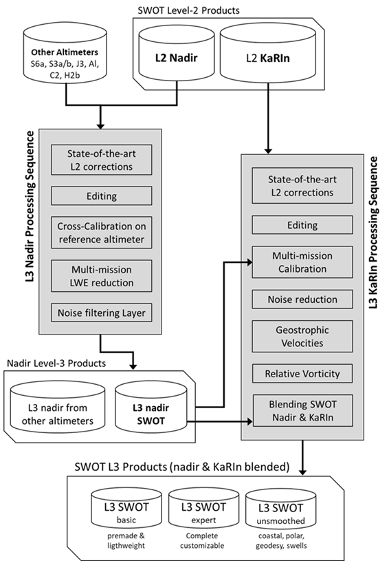
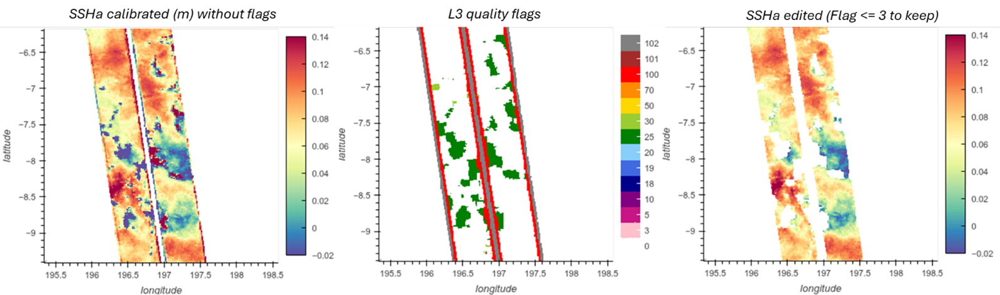
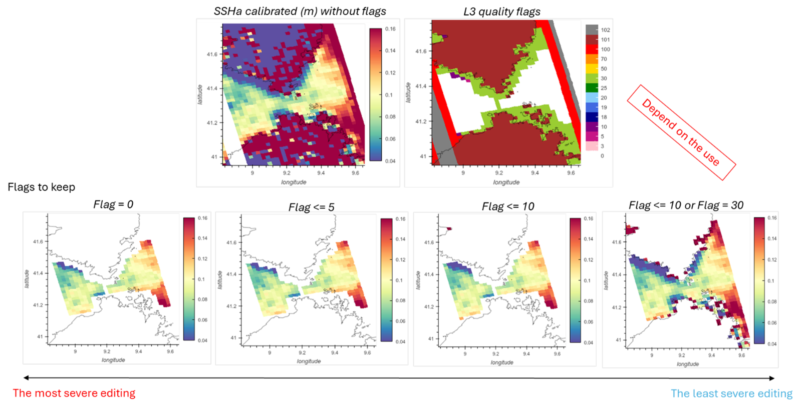
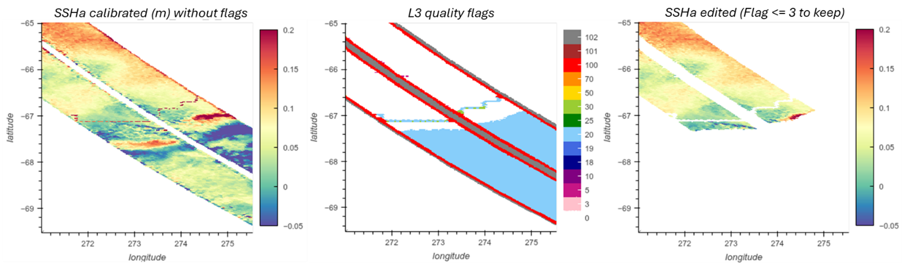
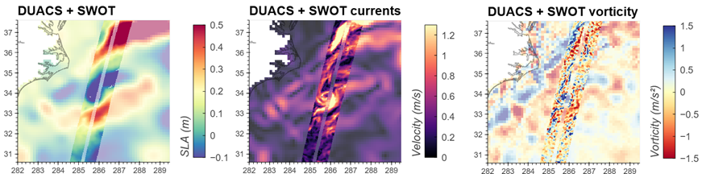
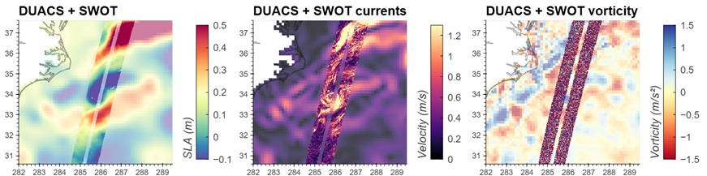

Processing
==========

This section describes the processing of the SWOT L3 KaRIn (L3_LR_SSH) product.
This product contains the KaRIn measurements as well as the Nadir measurements
(only in Expert and Basic products): KaRIn and Nadir instruments are blended
into a single image.

Note that a presentation dedicated to the processing named “SWOT Level-3
Overview and link with L2 products”, from Dibarboure et al., have been presented
at the SWOT Science Team in June 2024. The processing methodology for SWOT level
3 products is outlined in a paper by Dibarboure et al. (2024).

Processing method
-----------------

The following figure provides an overview of the system for the generation of
the SWOT L3 KaRIn ocean product. The Nadir component follows the same processing
as the other altimeters as described in Pujol et al., 2023, and the L3 KaRIn
processing sequence is given. The resultant L3 KaRIn  ocean product contain both
KaRIn and Nadir measurements.

    DUACS and SWOT L3 KaRIn and Nadir system processing

Input data
----------

The input data used to compute the SWOT L3 KaRIn ocean product is the SWOT
L2_LR_SSH, defined with a 2x2km or 250x250m spatial posting rate and distributed
by the CDS-AVISO (https://doi.org/10.24400/527896/a01-2023.015). The version of
these products evolves with time. The :ref:`standard <standards>` table lists
the L2_LR_SSH product versions used in the L3_LR_SSH production.

.. _standards:

250m swath reconstruction
-------------------------

The L2 LR 250m product presents the data into separated 'left' and 'right'
swaths, with possibly missing lines in the swath grid definition. A specific
acquisition aims to consolidate the product into a unified format compatible
with other the LR datasets defined on a reference grid (no missing lines, no
left/right separation).

The acquisition and preprocessing of the L2 LR 250m product performs several
crucial steps to achieve this unification:

Swath Merging
  The unsmoothed products contain distinct data groups for the left and right
  instrument swaths. A core function merges these two sections into a single,
  continuous 2D array. This involves flipping the left swath and concatenating
  it with the right. A 39-pixel gap is inserted at the center to represent the
  nadir gap, ensuring a continuous cross-track dataset

Time Synchronization
  The script reads and validates the time vectors from
  both swaths. It then computes a single, unified time vector for each
  measurement line, typically by averaging the left and right timestamps.

Data Masking
  Invalid measurements are meticulously filtered out. A Boolean
  mask is generated based on valid latitude and time values, ensuring that only
  robust data points are processed and stored.

Variable Reading
  Data loading is primarily handled by a variable reader. This function iterates
  through a list of specified product files and reads the designated variables.
  The valid data mask is consistently applied to all variables, guaranteeing
  uniform dimensions across the dataset.

Geolocation Interpolation
  For longitude and latitude variables, a dedicated function interpolates any
  gaps in the geolocation data. This step is vital for constructing a complete
  and continuous swath.

Generating Supplemental Variables
  To maintain compatibility with standard LR products, the script can generate
  variables not present in the original unsmoothed files

    - cross_track_distance: Calculated by a function based on a predefined instrument geometry.
    - valid_location_flag: Generated by a function to indicate whether the geolocation at each pixel is original or was filled via interpolation.

Metadata Extraction
  Essential metadata, such as cycle_number and pass_number, are extracted
  directly from the product filenames using a regular expression pattern.

Up-to-date standards
--------------------

The measurements are then updated with the standards as follows

.. tabs::

    .. tab:: V3.0

        .. csv-table::
            :file: standards_v3.csv
            :widths: 30, 70
            :header-rows: 1
            :delim: ;

    .. tab:: V2.0 and V2.0.1

        .. csv-table::
            :file: standards_v2.csv
            :widths: 30, 70
            :header-rows: 1
            :delim: ;

    .. tab:: V1.0.2

        .. csv-table::
            :file: standards_v1.0.2.csv
            :widths: 30, 70
            :header-rows: 1
            :delim: ;

    .. tab:: V1.0

        .. csv-table::
            :file: standards_v1.csv
            :widths: 30, 70
            :header-rows: 1
            :delim: ;

Cross-calibration
-----------------

The correction is computed with the XCAL algorithm. The reference for the XCAL
algorithm is Dibarboure et al., June 2022, SWOT Science Team meeting,
`SWOT simulated Level-2 and Level-3 data-driven calibration <https://meetings.aviso.altimetry.fr/fileadmin/user_upload/SWOTST2022/Plenary_Tuesday_Ocean/04_Dibarboure_XCalibration_STmeeting_202206v4.pdf>`_
and Dibarboure et al., Sep 2023, SWOT Science Team meeting,
`Crossover Calibration Status and Examples <https://swotst.aviso.altimetry.fr/fileadmin/user_upload/SWOTST2023/20230919_3_Karin_overview2/14h00-Dibarboure_xcalSummary.pdf>`_.

The Level-3 calibration correction aims to reduce systematic errors in KaRIn and
ensure its measurements are consistent with L3 products from other altimeter
missions. Therefore, data from operational nadir altimeters are used in the
KaRIn calibration process. KaRIn systematic errors are first estimated over
ocean areas using pre-selected KaRIn measurements. The residuals, relative to
multi-mission nadir data, are decomposed into roll errors and phase-screen
errors. The resulting calibration correction is then interpolated over invalid
measurement areas, including holes over ocean, continents and polar areas. This
calibration is estimated using LR 2x2km upstream data.

The methodology has been refined through successive versions of L3 products.

In the L3 V1.0 version, the calibration has been improved with an updated phase
screen correction with two components (varying with beta angle and in-orbit
position) and an improved interpolation method for short segments

In the v2.0 version, the calibration has been improved with the aim of reducing
the leakage of the ocean dynamic signal and taking into account the improvements
made to the data selection processing:

  * A large part of the data selection is newly applied before calibration
  * Data eclipse transition segments are used in the calibration
  * Fewer degrees of freedom are used
  * L3 pseudo phase screen corrections remain unchanged w.r.t v1.0.2

In the V3.0 version, the calibration has been improved with a better estimation
of the roll errors by adding harmonics on the day frequency; the use of an
optimal interpolation methodology to estimate the roll correction in areas where
direct estimation is not possible; and update of the static phase screen
component for the PID product version.

The correction applied on the 250x250m product is an interpolation of the
solution computed using 2x2km data.

Editing
-------

The editing process mainly consists in applying the flags that are in the
L2_LR_SSH input files. The variables taken into account are:

  * ancillary_surface_classification_flag (to keep only ocean data)
  * ssha_KaRIn_2_qual (L2 product flags)
  * ssh_KaRIn_uncert (measurement uncertainty)
  * distance_to_coast  (for the coastal flag)
  * cross_track_distance (distance from the nadir)
  * Ice_concentration (for the polar flag)
  * sig0_karin_2 (for the sea-ice classification of the Unsmoothed product)
  * rain_rate_rf (for the rain flag)

From the L3_LR_SSH v1.0, a flag expert was created. Its content has been refined
throughout the successive versions of L3 products. The following table gives the
different flag values available for each version.

.. tabs::

  .. tab:: V3.0

    * Flag #102: No SSHa values available
    * Flag #101: Pixels over land
    * Flag #100: Edges of swath. Only values between 10 to 60 km to the nadir
      are considered as valid data
    * Flag #70: Pixels impacted by spacecraft events
    * Flag #50: Abnormally high SSHA values
    * Flag #25: Rain Cells
    * Flag #30: SSHA pixels out of the expected statistical distribution
    * Flag #20: Suspected sea-ice pixels (high probability)
    * Flag #19: Suspected sea-ice pixels (medium probability) [**Unsmoothed only**]
    * Flag #18: Suspected ocean pixels (medium probability) [**Unsmoothed only**]
    * Flag #10: Suspected coastal pixels
    * Flag #5: SSHA pixels out of the local distribution.
    * Flag #3: Eclipses
    * Flag #0: Valid data

  .. tab:: V2.0 and V2.0.1

    * Flag #102: No SSHa values available
    * Flag #101: Pixels over land
    * Flag #100: Edges of swath. Only values between 10 to 60 km to the nadir
      are considered as valid data
    * Flag #70: Pixels impacted by spacecraft events
    * Flag #50: Abnormally high SSHA values
    * Flag #30: SSHA pixels out of the expected statistical distribution
    * Flag #20: Suspected sea-ice pixels (high probability)
    * Flag #19: Suspected sea-ice pixels (medium probability) [**Unsmoothed only**]
    * Flag #18: Suspected ocean pixels (medium probability) [**Unsmoothed only**]
    * Flag #10: Suspected coastal pixels
    * Flag #5: SSHA pixels out of the local distribution.
    * Flag #3: Eclipses
    * Flag #0: Valid data

  .. tab:: V1.0

    * Flag #102: No SSHa values available
    * Flag #101: Pixels over land
    * Flag #100: Edges of swath. Only values between 10 to 60 km to the nadir
      are considered as valid data
    * Flag #70: Pixels impacted by spacecraft events
    * Flag #50: Abnormally high SSHA values
    * Flag #30: SSHA pixels out of the expected statistical distribution
    * Flag #20: Suspected sea-ice pixels (high probability)
    * Flag #10: Suspected coastal pixels
    * Flag #5: SSHA pixels out of the local distribution.
    * Flag #0: Valid data

More details about each flag are available in Dibarboure et al (2024). The
following figures show some cases of use of the flag expert. For most studies,
we recommend keeping only flag #0 to flag #3.

    Example of editing of the rain cells (C19 P556). Keeping flags #0 to #3
    (v2.0.1 and later versions) is recommended

    Figure 4: Example of editing of coastlines (C19 P542) in v3.0

    Example of editing of polar (C19 P552) areas in v3.0

Filtering
---------

Despite its unprecedented precision, SWOT’s Ka-band Radar Interferometer (KaRIn)
still exhibits a substantial amount of random noise. A filtering method is then
applied, it is described in Treboutte et al., 2023. It consists of a Neural
Network which is based on a U-Net architecture and is trained and tested with
simulated data from the North Atlantic.

The following table presents the denoising differences between the different
versions of the L3_LR_SSH products

.. list-table::
    :header-rows: 1

    * -
      - Version 0.3
      - Version 1.0 to 2.0.1
      - Version 3.0
    * - | Training dataset
      - | Based on the eNATL60 ocean model without tides Noise generated by the
        | SWOT simulator
      - | Based on the eNATL60 ocean model with tides. Correlated Noise
        | generated by style transfer to be as realistic as possible
      - | Based on the eNATL60 ocean model with tides. Realistic editing from L3
        | real swaths is applied on simulated swaths. No style-transfer
    * - Use of the [Gomez et al, 2020] algorithm
      - Yes
      - No
      - No

More details about the training dataset are available in Dibarboure et al.
(2024).

The following figure shows the impact of the filtering in the resultant current
and the vorticity

    Sea Level Anomalies of DUACS and SWOT L3 v3.0 measurements (left), deduced
    current (middle) and vorticity (right) with the denoising applied (top) and
    without (bottom)

SSHA derivatives and geostrophic currents estimation
----------------------------------------------------

An estimation of the geostrophic currents is proposed in L3 KaRIn products. The
methodology used to compute the anomaly of the currant is presented in the
following table. The mean current is issued from the MDT field (Jousset et al.
2025)

.. list-table::
    :header-rows: 1

    * - Version 0.3
      - Version 1.0 to 2.0.1
      - Version 3.0
    * - | 2-points stencil methodology from “denoised” SSHA. in along and across
        | swath direction. The current is then interpolated on Northward and
        | Eastward direction
      - | 6-points stencil methodology from “denoised” SSHA. in along and across
        | swath direction. The current is then interpolated on Northward and
        | Eastward direction. An estimation of the SSH gradients from unfiltered
        | (raw) SSHA measurements is also proposed using the same methodology
      - | 2D spline fitting for “denoised” SSHA (Tranchant et al. 2025)
        | An estimation of the SSH gradients from “unfiltered” (raw) SSHA
        | measurements is also proposed using the same methodology

Know limitations
::::::::::::::::

The SSH measured by KaRIn is not just from mesoscale but also a synoptic view of
unbalanced motions and barotropic residuals. Denoising/filtering processing
applied may not allow to accurately extract the balanced motion. Specifically,
geostrophy assumption might simply no longer be relevant for the smallest scales
observed by KaRIn
